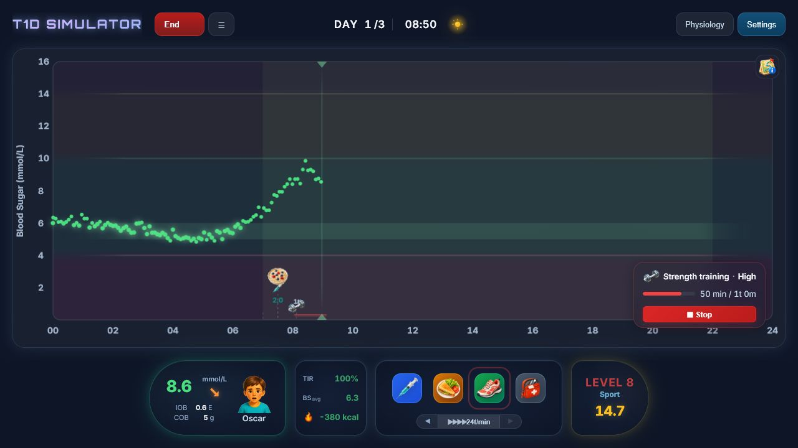

# T1D Simulator

**Try. Learn. Repeat.**


> **This project is developed continuously.** Features, physiological mechanisms and model checks are expanded over time.

T1D Simulator is an educational game about type 1 diabetes glucose physiology. The player helps fixed fictional characters by choosing insulin, food and activity, then observes how the characters' blood glucose responds. Rapid feedback makes physiological patterns easier to explore and compare across fixed fictional scenarios.

> **Purpose and limitations — see [below](#purpose-and-limitations)**

## Support the project

This simulator is a free, open-source passion project built in my spare time. If you find it useful — whether as a patient, parent, or educator — consider buying me a coffee. Your support helps cover project costs and lets me dedicate more time to improving the simulation and adding new features.

[](https://buymeacoffee.com/krauhe)
[](https://qr.mobilepay.dk/box/0946757d-b34b-4b1e-8302-f0a67fc49c69/pay-in)

## Try it

**[Play online](https://krauhe.github.io/t1d-simulator/)** — no installation required. The link automatically opens the version that fits your device: the full desktop UI on PC and tablet, or a touch-optimized layout on phones. You can switch at any time — both versions have a "switch version" option.

On a phone you can also jump straight to the **[mobile version](https://krauhe.github.io/t1d-simulator/mobile/)**.

Or clone/download the full repository and open `index.html` in a browser. No server, no build step needed — but the JS, CSS and asset files must be present alongside `index.html`.

## Feedback & Bug Reports

Found a bug? Have an idea for improvement? We'd love to hear from you!

- **GitHub Issues** (preferred) — [Open an issue](https://github.com/krauhe/t1d-simulator/issues) to report bugs or suggest features. Requires a free GitHub account.
- **Email** — Send a message to **t1d.simulator@gmail.com** if you prefer a simpler option.
- **Facebook** — Join the [T1D Simulator group](https://www.facebook.com/groups/t1dsimulator) for discussion and updates.

All feedback is welcome — from technical bug reports to "this felt confusing" comments. You don't need to be a developer to contribute!

## What is simulated?

- **Glucose-insulin dynamics** based on the published [Hovorka et al. (2004)](https://doi.org/10.1109/TBME.2004.827938) research model from Cambridge
- **Carbohydrate absorption** with variable gastric emptying
- **Fat compartment model** — two-compartment (stomach → intestine) with CCK/GLP-1 feedback slowing carb absorption ("pizza effect")
- **Protein glucagon model** — amino acid absorption driving glucagon-stimulated hepatic glucose production via Hill function
- **Insulin pharmacokinetics** with subcutaneous depot, plasma and effect compartments
- **Three activity types** (cardio, strength training and mixed sport) with distinct physiology
- **Stress hormones** (cortisol, adrenaline) with dawn phenomenon and acute counter-regulation after hypoglycemia
- **Circadian ISF variation** — morning insulin resistance vs. evening sensitivity
- **CGM simulation** with realistic sensor delay, noise and drift
- **Ketone metabolism** and DKA progression during insulin deficiency
- **Hypoglycemia unawareness (HAAF)** — impaired counter-regulation after repeated hypos
- **Liver glycogen pool** — mass-balanced with glycogenolysis and replenishment
- **Sleep disruption** — nocturnal interventions increase next-day insulin resistance
- **Glucotoxicity** — sustained hyperglycemia progressively impairs insulin sensitivity (Vuorinen-Markkola 1992)
- **Weight & calorie model** — energy balance with BMR scaling and exercise expenditure

<details>
<summary><strong>Everyday phenomena and physiological variability you can explore</strong></summary>

### Food, digestion and delayed absorption

| Modelled phenomenon | Everyday example |
|---|---|
| **Carbohydrate absorption** | Juice raises blood glucose quickly, while bread, pasta and mixed meals usually appear more slowly because they must be digested first. |
| **Dynamic gastric emptying** | The same amount of carbohydrate can arrive faster or slower depending on meal composition, current blood glucose and recent activity. |
| **Fiber-mediated absorption delay** | A high-fiber meal can produce a flatter, slower blood glucose rise because fiber delays gastric emptying and intestinal absorption. |
| **Hyperglycemia-delayed gastric emptying** | When blood glucose is already high, the stomach can empty more slowly, so a meal may appear later than expected. |
| **Exercise-mediated gut delay** | During harder exercise, blood flow shifts toward working muscle, so a pre-exercise snack may reach the blood more slowly. |
| **Pizza effect: gastric delay** | A high-fat meal can produce a delayed rise because fat slows gastric emptying. |
| **FFA-induced insulin resistance** | Several hours after a fatty meal, free fatty acids can make insulin less effective, producing a later second rise. |
| **Protein-glucagon effect** | A large protein meal can raise blood glucose slowly later because amino acids stimulate glucagon-driven hepatic glucose production. |

### Insulin action and injection variability

| Modelled phenomenon | Everyday example |
|---|---|
| **Rapid insulin pharmacokinetics** | Rapid insulin does not work immediately; it must move from the subcutaneous depot into plasma before it can lower blood glucose. |
| **Insulin action delay / insulin on board** | Blood glucose can keep falling after a bolus because insulin action continues while active insulin remains in the model. |
| **Basal insulin tail** | Long-acting insulin provides background coverage for many hours; too little basal gives a slow rise, too much can give a gradual fall. |
| **Insulin absorption variability** | The same bolus can peak earlier or later because subcutaneous absorption varies from injection to injection. |
| **Basal duration variability** | Long-acting insulin can last a little shorter or longer from day to day, so background coverage can fade or persist at different times. |
| **Injection-site and blood-flow variability** | Heat, activity, injection site and local blood flow can change how quickly insulin is absorbed. |
| **Pulse-accelerated insulin absorption** | Exercise or high heart rate can accelerate insulin absorption by increasing subcutaneous blood flow. |

### Activity, stress and circadian effects

| Modelled phenomenon | Everyday example |
|---|---|
| **Aerobic exercise glucose uptake** | Cardio can lower blood glucose because working muscle takes up more glucose, especially when rapid insulin is active. |
| **Anaerobic exercise stress response** | Strength training or high intensity can initially raise blood glucose because adrenaline stimulates hepatic glucose output. |
| **Post-exercise insulin sensitivity** | After activity, insulin may work more strongly for hours while muscles replenish glycogen. |
| **Muscle glycogen recovery** | After exercise, muscles can pull glucose from blood to rebuild glycogen stores, which can contribute to delayed lows. |
| **Acute counter-regulation after hypoglycemia** | Low blood glucose triggers adrenaline/glucagon-driven hepatic glucose output, but this response is limited in T1D. |
| **Hypoglycemia-associated autonomic failure (HAAF)** | Repeated lows can make later lows harder to detect and weaken counter-regulation. |
| **Hepatic glycogen limitation** | Glucagon and counter-regulation work less well when liver glycogen is depleted after fasting, exercise or repeated stress responses. |
| **Emergency glucagon response** | A glucagon injection can raise blood glucose by mobilizing liver glycogen, but the effect depends on available liver stores. |
| **Dawn phenomenon** | Blood glucose may rise in the morning even without food because cortisol increases hepatic glucose output. |
| **Circadian insulin sensitivity** | The same insulin dose may work less strongly in the morning than later in the day. |
| **Dawn amplitude variability** | The dawn effect is not identical every morning; its strength and timing vary from day to day. |
| **Sleep disruption / partial sleep deprivation** | Nighttime interventions can increase next-day stress and amplify the morning rise. |
| **Sleep-loss variability** | A nighttime awakening does not always cost the same amount of sleep; sometimes it is brief, sometimes it lasts longer. |

### Ketones, safety and longer-term effects

| Modelled phenomenon | Everyday example |
|---|---|
| **Ketogenesis / insulin deficiency** | With too little insulin over time, the body releases more fatty acids and produces ketones as an alternative fuel. |
| **Lipolysis gate** | When insulin is low, fat tissue releases more free fatty acids into circulation. |
| **CPT-1 gate / hepatic ketogenesis** | Low insulin makes it easier for the liver to route fatty acids into ketone production. |
| **FFA-driven ketone production** | Ketones rise mainly when low insulin increases free fatty acid supply, not simply because blood glucose is high. |
| **BHB clearance saturation** | At higher ketone levels, clearance cannot always keep up with production, so beta-hydroxybutyrate can rise faster. |
| **Fasting ketosis vs. DKA** | Ketones can rise during fasting without becoming DKA; the model separates fasting ketosis from insulin-deficient acidosis load. |
| **DKA acidosis load** | DKA risk depends on ketones over time during insulin deficiency, so the simulator accumulates acidosis load rather than using one instant value. |
| **Glucotoxicity** | Sustained high blood glucose can make insulin less effective over time, making the curve harder to bring down. |
| **Renal glucose excretion** | At high blood glucose, filtered glucose exceeds renal reabsorption capacity and some glucose is lost in urine. |
| **Brain energy deficit / neuroglycopenia** | Very low blood glucose over time creates a brain glucose deficit in the model. |
| **Calorie balance / weight change** | Over longer periods, body weight changes with food intake, resting expenditure and exercise expenditure. |

### Sensors, measurements and biological uncertainty

| Modelled phenomenon | Everyday example |
|---|---|
| **CGM interstitial delay** | A CGM can lag behind true blood glucose because it senses interstitial fluid rather than plasma. |
| **CGM random noise** | Sensor readings have random measurement noise, so small jumps do not always mean true blood glucose changed that much. |
| **CGM systematic drift** | A sensor can slowly drift up or down over hours even when true blood glucose is more stable. |
| **CGM artifacts and discontinuities** | Compression or transient sensor errors can create sudden jumps that are not mirrored by plasma glucose. |
| **Fingerstick measurement uncertainty** | A fingerstick is closer to plasma glucose than CGM, but still has small measurement uncertainty. |
| **Ketone strip uncertainty** | Ketone strip values are estimates, so a single reading should be interpreted with context. |
| **Day-to-day outcome variability** | The same food, insulin and timing can produce a different curve because absorption, dawn, sleep, activity and sensor behavior vary together. |

</details>

## Screenshots


*Campaign level 8. Oscar is visible in the BG Hero panel while rapid insulin, a meal and high-intensity strength training are marked on the blood-glucose graph.*

## Tech stack

- Vanilla HTML / CSS / JavaScript — no frameworks, no build step
- [Tone.js](https://tonejs.github.io/) for sound effects (loaded from CDN)
- Hovorka 2004 core model, extended to 16 ODE state variables, solved with Euler integration

## Using the physiology engine in your own project

The physiological model is a **self-contained, dependency-free module** in
[`js/physiology-engine.js`](js/physiology-engine.js). It has no DOM, sound, i18n, score
or global-variable dependencies — it speaks only mmol/L, plain numbers and structured
events. It owns the simulation clock, all physiological state, its own Hovorka ODE core,
the full physiology tick (`step()`), steady-state initialization, the interventions
(food / insulin / activity / glucagon) and a read API. That means you can drive it
directly from your own application, lab script or test harness — the game's `Simulator`
class is just one consumer of it.

```js
// Node (CommonJS). In the browser use T1DPhysiologyEngine.createEngine(...) the same way,
// with hovorka.js loaded before physiology-engine.js.
const { createEngine } = require('./js/physiology-engine.js');

// steadyState:true → starts at equilibrium with its own basal depot (no manual setBG).
// clinicalEvents:true → step() reports threshold/severity events (e.g. hypo).
const engine = createEngine(
    { weight: 70, isf: 3.0, icr: 10 },        // hypothetical model subject; not personal input
    { seed: 42, steadyState: true, clinicalEvents: true }
);

engine.addFood({ carbs: 40 });                // a 40 g carb meal
engine.addRapidInsulin({ units: 4 });         // a 4 U rapid bolus

for (let min = 0; min < 180; min++) {
    const { state, events } = engine.step(1); // advance 1 simulated minute
    for (const e of events) {
        if (e.type === 'glucose-low') console.log(`min ${min}: hypo (${e.severity})`);
    }
    console.log(min, state.trueBG.toFixed(2), state.iob.toFixed(2));
    engine.consumeEvents();                   // drain the event buffer
}
```

A deterministic `seed` makes runs reproducible; `setNoise(false)` gives a clean CGM
signal for plotting. The full reference — profile contract, all options, every
intervention, the read API, determinism, snapshots and scenarios — is in
**[Physiology engine API](docs/MODEL-API.md)**, with runnable checks in
[`tests/physiology-engine-api.test.js`](tests/physiology-engine-api.test.js).

The low-level engine intentionally accepts numeric model parameters for reproducible
development, testing and calibration. The public game does not expose those fields: it
stores a fictional `characterId` and resolves that character's fixed profile at runtime.
Supplying a real person's values to the source API does not make the population model an
individual predictor.

> The engine is a research and development model component, not an individual
> prediction or treatment component. See [purpose and limitations](#purpose-and-limitations)
> before building anything on it.

## Physiological modelling

- [Scientific overview](docs/BG-SCIENCE.md) — All factors affecting blood sugar in T1D (25+ topics with references)
- [Model implementation](docs/MODEL-IMPLEMENTATION.md) — How the simulator engine works (Hovorka 2004, insulin, exercise, stress hormones)
- [Physiology engine API](docs/MODEL-API.md) — Lab API for deterministic snapshots, noise control, clamps and scenarios
- [Visual model-behaviour checks](tests/model-validation.html) — 51 test sections with plotted curves and explicit intervention markers (open in browser)
- [Engine API tests](tests/physiology-engine-api.test.js) — Direct Node checks for the standalone engine API, run with `tests/.bin/node.exe tests/physiology-engine-api.test.js`
- [Automated tests](tests/simulation.test.js) — 190+ automated checks for individual model mechanisms and game logic, run with `tests/.bin/node.exe tests/simulation.test.js`
- [Physiology regression runner](tests/run-physiology-regression.js) — Runs engine API, golden-master and full Node suite with `tests/.bin/node.exe tests/run-physiology-regression.js`

## File structure

```
index.html          ← Open this in a browser
style.css           ← All styling
js/
  sounds.js         ← Sound effects (Tone.js)
  i18n.js           ← Internationalization (Danish/English)
  levels.js         ← Campaign level definitions
  foods.js          ← Food presets and carbohydrate-type parameters
  hovorka.js        ← Hovorka 2004 glucose-insulin ODE model
  physiology-engine.js ← Standalone physiology engine API (see docs/MODEL-API.md)
  simulator.js      ← Simulator class: physiology + game mechanics
  ui.js             ← Graph, UI updates, popups
  game.js           ← Game loop, start/reset/pause
  campaign.js       ← Campaign progression, objectives, stars, tips and character scenes
  main.js           ← Event listeners, DOM references, init
docs/
  MODEL-IMPLEMENTATION.md     ← Technical model description (English, primary)
  BG-SCIENCE.md        ← Scientific background (English, primary)
  references/       ← Downloaded scientific articles
tests/
  physiology-engine-api.test.js ← Direct engine API checks (Node, no DOM mocks)
  run-physiology-regression.js ← Engine API + golden-master + full suite
  simulation.test.js   ← Automated model checks
  model-validation.html ← Visual model-behaviour checks (browser)
```

## Credits

**Idea, design & physiological modelling**

Kristian R. Harreby — with AI-assisted research and implementation (Codex/OpenAI, Claude/Anthropic and Gemini/Google).

*Note: Source code and automated tests are primarily generated via AI and have not undergone a complete manual audit.*

**Core model**

- **[Hovorka et al. (2004)](https://doi.org/10.1109/TBME.2004.827938):** Glucose-insulin ODE core extended in this simulator to 16 state variables — covers insulin pharmacokinetics, carbohydrate absorption, glucose kinetics, CGM delay, exercise states, and basal/rapid insulin separation.
- **Open source foundation:** Inspired by [svelte-flask-hovorka-simulator](https://github.com/JonasNM/svelte-flask-hovorka-simulator) by Jonas Nordhassel Myhre.

**Model extensions and scientific sources**

The simulator extends the Hovorka core with additional physiology for exercise, stress, dawn/circadian variation, ketones, sleep disruption, fat/protein effects, glucotoxicity, glucose measurement uncertainty and longer-term energy balance. The visitor-facing overview is kept in [What is simulated?](#what-is-simulated); implementation details and literature references are kept in [Model implementation](docs/MODEL-IMPLEMENTATION.md) and [Scientific overview](docs/BG-SCIENCE.md).

**Technologies**

- **Sound effects:** [Tone.js](https://tonejs.github.io/)
- **Background music:** "Pixel Sipper" — AI-generated via [HeartMuLa](https://heart-mula.com) (Apache 2.0)
- **License:** [GNU General Public License v3 (GPLv3)](https://www.gnu.org/licenses/gpl-3.0.html)

### Development Status & AI Disclosure

**This simulator is an experimental prototype.**

All design and architecture decisions are made by the project owner (Kristian R. Harreby). The codebase — including mathematical models, game logic and automated tests — is primarily generated using AI (Codex/OpenAI, Claude/Anthropic and Gemini/Google). Code is reviewed, tested and adapted by the project owner, but a line-by-line audit has not been performed.

The project includes 190+ automated checks and 51 visual test sections that check intended physiological behaviour.

## License

This project is licensed under the **GNU General Public License v3.0** — see the [LICENSE](LICENSE) file for details.

You are free to use, modify and redistribute this software under the terms of the GPLv3. Any derivative work must also be distributed under GPLv3.

Copyright © 2025–2026 Kristian R. Harreby

## Purpose and limitations

T1D Simulator is a learning game about factors that affect blood glucose in type 1 diabetes. The public game uses fixed fictional characters and does not accept personal treatment data.

It is not intended to diagnose, monitor, predict, or guide treatment for any individual, and it must not be used to calculate or adjust a real person's insulin dose. The simulation uses a simplified population model to demonstrate general physiological patterns in fixed fictional characters.

The public **What If** view can be opened from a played Campaign or Box Challenge course. It keeps the selected fixed character, lets the player compare alternative game actions within the played period, and simulates up to six additional hours. It accepts no personal parameters, identifies no preferred alternative, has no public import/export, and leaves the paused game unchanged.

The complete scope and the boundary between the public game, restricted What If view and open model engine are described in [Intended Purpose](docs/INTENDED-PURPOSE.md). Unrestricted developer controls are not part of the public runtime interface.

The authors accept no liability for harm resulting from use or misuse of this software.

---
