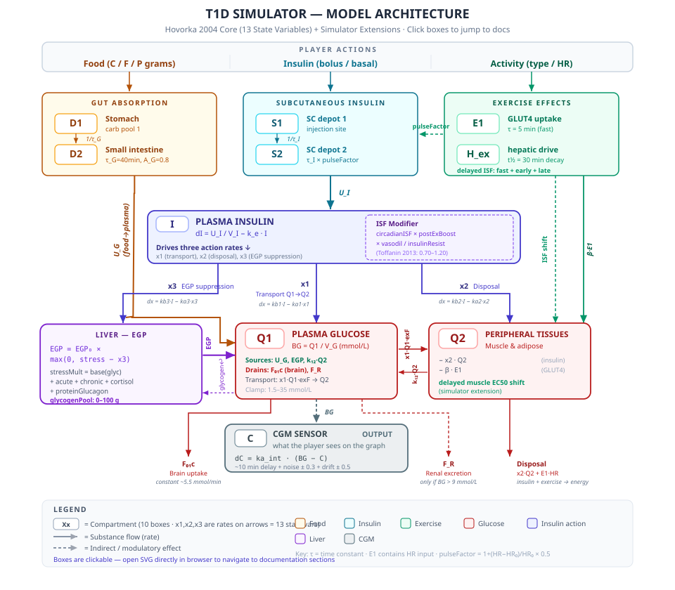
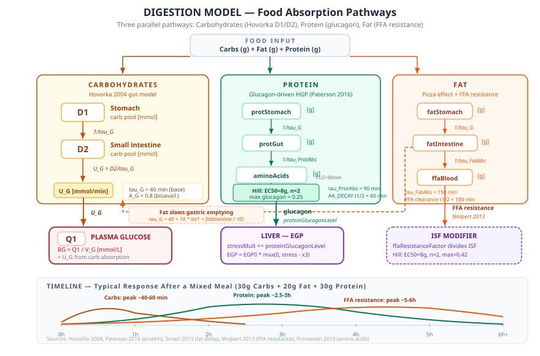
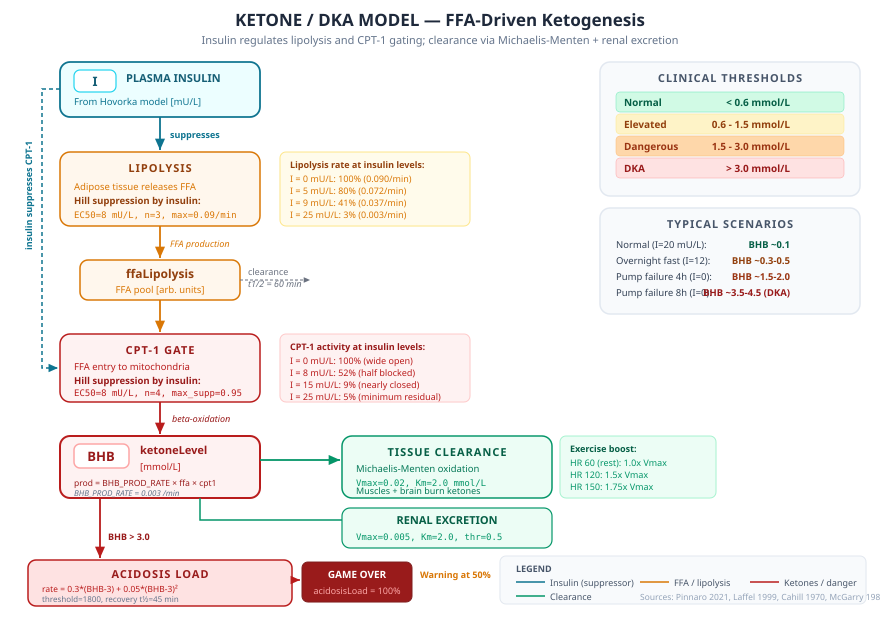
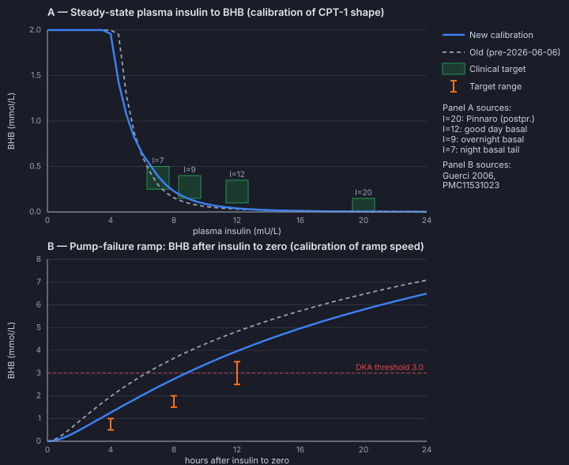

<!-- doc-version: 2026-07-30-v11 -->
# Physiological Model — T1D Simulator

*This page is the technical documentation of the simulator's physiological engine.
It describes how each model is implemented, why it is built the way it is,
and which scientific sources it rests on. The document is intended for developers,
researchers, clinicians, and other readers who want a transparent, implementation-level explanation of the model.*

**Purpose and limitations:** The public T1D Simulator is a learning game about factors
that affect blood glucose, demonstrated through fixed fictional characters. It does not
calculate insulin doses for real people and is not intended as a basis for treatment.
The physiological engine is a research and development model component, not a clinically
validated predictor of an individual's response.

---

## Table of Contents

1. [Overview — What do we simulate?](#overview)
2. [The Core Model: Hovorka 2004](#core-model)
3. [Glucose — Distribution and Utilization](#glucose)
4. [Insulin — Absorption and Action](#insulin)
5. [Food — From Plate to Bloodstream](#food)
6. [Activity — Four Activity Types with Different Physiology](#activity)
7. [Stress Hormones — Counterregulation and Hepatic Glucose Output](#stress-hormones)
8. [The Dawn Phenomenon — Morning Cortisol](#dawn)
9. [Sleep Disruption — Nighttime Interventions Come at a Cost](#sleep)
10. [Hypoglycemia Unawareness (HAAF)](#haaf)
11. [Ketones and Ketoacidosis (DKA)](#ketones)
12. [CGM Simulation — The Sensor's Limitations](#cgm)
13. [Variability — Why Doesn't It Work the Same Every Time?](#variability)
14. [Weight and Calorie Balance](#weight)
15. [Scoring and Game Over](#scoring)
16. [Limitations and Caveats](#limitations)
17. [Scientific References](#references)
18. [Open Source Software Used](#open-source)

---

<a name="overview"></a>
## 1. Overview — What do we simulate?

T1D Simulator simulates the glucose-insulin dynamics in a person with type 1 diabetes (T1D).
The simulation models the most important physiological processes that affect blood glucose:

1. **Glucose kinetics** — how glucose is distributed and consumed in the body
2. **Insulin pharmacokinetics** — how injected insulin is absorbed and takes effect
3. **Carbohydrate absorption** — how food is digested and glucose is absorbed into the blood
4. **Exercise effects** — how physical activity affects blood glucose
5. **Stress hormones** — how cortisol, adrenaline, and glucagon affect the liver
6. **Ketone metabolism** — how insulin deficiency leads to ketoacidosis
7. **CGM simulation** — realistic sensor delay and noise

All these systems are interconnected. Insulin lowers blood glucose, but exercise changes
how quickly insulin takes effect. Stress hormones cause the liver to release extra glucose.
Sleep deprivation makes insulin less effective. The simulator attempts to capture these dependencies
as realistically as possible — within the constraints of a game.

### How is the simulator structured?

The simulator runs like a clock that "ticks" every few seconds in real time. For each
tick it calculates:

- How much insulin is currently active in the body
- How much glucose is coming in from food
- How much glucose the liver is producing (influenced by stress hormones)
- How much glucose the muscles are taking up (influenced by exercise)
- What the CGM sensor would show (with delay and noise)

The result is a new blood glucose level that is displayed on the graph.

Numerically, the physiological core is substepped at `dt <= 1` simulated minute.
Active intake, fat/protein/FFA kinetics, rapid insulin depots, Hovorka ODEs,
ketones, muscle glycogen, glucagon, brain energy deficit, acidosis load, and
glucotoxicity are all integrated inside this substep loop. This keeps
counterregulation and damage accumulators independent of game speed and frame
timing.

### Code architecture — engine vs. facade

The physiology is implemented in a **standalone** engine, `PhysiologyEngine`
(`js/physiology-engine.js`), separated from the game/UI facade `Simulator`
(`js/simulator.js`). The engine owns the entire physiological tick: the
simulation clock, all state and constants, and `engine.step(simMinutes,
{onSample})`, which runs insulin-rate prep, carb/heart-rate prep, the substep
integration loop, post-step IOB and the CGM signal, then returns
`{ state, events }`. It also owns the interventions (food/insulin/activity/
glucagon), a read API (`getState`/`getFluxSnapshot`/`getPhysiologySnapshot`),
and the lab API (determinism, `setBG`, plasma clamp, export/import,
`runScenario`). The Hovorka ODE core lives in `js/hovorka.js` (`HovorkaModel`);
the engine **builds its own instance** in its constructor from the profile
(mapping the simulated character's ISF via `HOVORKA_REFERENCE_ISF`), so a caller no longer
needs to attach it (`attachHovorka()` remains for advanced override). The engine
also owns steady-state initialization — `initSteadyState()` finds the basal rate
and establishes a basal depot so a bare engine holds its level instead of drifting
(`createEngine(profile, {steadyState:true})` for a ready-to-run engine) — plus
`reset()`, a built-in default activity catalog, object-form interventions
(`addRapidInsulin({units})`), and opt-in clinical threshold/severity events
(`{clinicalEvents:true}`). The engine has no DOM/sound/i18n/score/globals
dependencies.

The engine/API boundary is intentionally different from the public game boundary.
The engine accepts explicit weight, ISF and ICR values because calibration scripts,
model tests and local scenario authoring require reproducible hypothetical subjects.
The public application does not expose those fields: it stores only a fixed fictional
`characterId`, resolves the corresponding values from `js/archetypes.js`, and discards
raw profile values supplied through public storage or normal start functions. A
numeric engine profile is a model configuration, not validation for an individual.

Steady-state calibration keeps the historical 0.5–20 mU/min binary-search bracket
for ordinary profiles, preserving established trajectories bit-for-bit. If the
result reaches either boundary without attaining the requested BG, the search
expands adaptively down to 0 or up to a hard safety ceiling of 500 mU/min. A result
is accepted only when the final BG is within 0.02 mmol/L of the target; unreachable
targets throw a `RangeError` that reports the relevant boundary and achieved BG
instead of returning a misleading state.

The engine also owns every physiological mechanism that used to be triggered from
the facade, so a bare engine reproduces the full game physiology on its own: the
day-1 dawn parameters are seeded in the constructor (`regenerateDawn()`); the CGM
sensor state machine — warmup, auto self-test on an implausible signal, and sensor
loss — lives in `step()`/`_sampleCgm` (`startCgmSelfTest`/`startCgmSensorLoss`); and
sleep disruption is fully engine-owned (`registerNightIntervention` accrues sleep
loss when an intervention happens at night, `applySleepDebt` converts it to chronic
stress, and `_processSleepCrossings` runs the 22:00/07:00 clock transitions from
`step()`). Each emits structured events; the facade renders sound and graph UI from
them.

`Simulator` is the **game's** public facade: each tick it calls `engine.step()`,
supplies the graph-sampling `onSample` callback, and runs the game post-step
(`_postStep`: steep-drop UI, graph history, sound, score, weight, game-over,
DOM, Box Challenge). It delegates interventions and snapshots to the engine and
adds game bookkeeping (campaign goals, kit cooldowns, game-specific basal
pre-injection). The sleep-disruption mechanism itself is engine-owned (see above);
the facade only triggers it via a thin `registerNightIntervention` wrapper for
game-only actions that have no engine intervention (fingerstick, ketone test) and
for campaign-scripted awakenings. The engine never calls UI, sound, i18n or
game-over directly — it emits structured events that the facade translates. The migration is documented
in `docs/reviews/physiology-engine-LOG.md`; the engine's programmatic API
(including a standalone usage example) is in `docs/MODEL-API.md`. The split
makes the physiology reusable in new applications (other games, Node labs,
scenario tools) without the game UI.

> Implementation-link note: code references below point to `js/simulator.js`
> for facade/intervention code (e.g. `addFastInsulin`) and to
> `js/physiology-engine.js` for the physiological computation (substep loop,
> CGM, ketones, stress, etc.). The science is unchanged by this reorganization —
> the migration was verified bit-identical against a golden-master regression.

### Model Architecture — Compartment Diagram

The engine is built on the **Hovorka 2004** compartment model, extended to 16 coupled ordinary
differential equations (ODEs) describing how glucose and insulin move through the body.
On top of this published core, the simulator adds extensions for food composition,
exercise physiology, stress hormones, circadian rhythms, and more.

The diagram below shows all 16 state variables (colored boxes), the flows between them
(arrows with rate constants), and the player actions that drive the system.



> 📊 **[Compartment diagram: System Overview](diagrams/overview/overview-diagram.html)** — all subsystems, state variables, and inter-system flows in one interactive view.

<details>
<summary>Text version of the diagram (for accessibility / plain text)</summary>

```
                              PLAYER ACTIONS
                  ┌───────────┬───────────┬───────────┐
                  │   Food    │  Insulin  │ Activity  │
                  │ (C/F/P g) │  (units)  │ (type/HR) │
                  └─────┬─────┴─────┬─────┴─────┬─────┘
                        │           │           │
          ┌─────────────┘           │           └─────────────┐
          │                         │                         │
          ▼                         ▼                         ▼
  ┌───── GUT ─────┐      ┌────── SUBCUTANEOUS ──────┐  ┌──── EXERCISE ────┐
  │               │      │ RAPID    │  BASAL        │  │                   │
  │  D1 (stomach) │      │ S1→S2    │  S1b→S2b      │  │  E1    τ = 5 min │
  │   ↓  1/τ_G    │      │ τ_I var. │  baseTauI=55  │  │  (GLUT4 uptake)  │
  │  D2 (gut)     │      │ ↓ pulse  │  ↓ pulse      │  │  hepatic drive   │
  │   ↓  × A_G    │      │ U_I      │  U_Ib  → Ib   │  │  delayed ISF     │
  └───────┬───────┘      └───┬──────┴──────┬────────┘  └──┬────────────┬──┘
          │                  │             │               │            │
          │ U_G              │ U_I    U_Ib              β·E1       EC50 shift
          │                  │     (both→I)                │     + hepatic EGP
          ▼                  └──────┬──────┘               ▼            │
  ┌──────────────────────────────────────────────────────────────────────┐
  │  Q1 — PLASMA GLUCOSE                  BG = Q1 / V_G  (mmol/L)      │
  │                                                                      │
  │  Sources (+):                     Drains (−):                        │
  │    U_G    food absorption           F₀₁c  brain (~5.5 g/hr)         │
  │    EGP    liver production          F_R   kidneys (BG > 9 mmol/L)   │
  │    k₁₂·Q2  return from muscles     x1·Q1·exF  transport → Q2       │
  └──────────────────┬───────────────────────────────▲───────────────────┘
                     │ x1·Q1·exerciseFactor          │ k₁₂·Q2
                     ▼                               │
  ┌──────────────────────────────────────────────────┴───────────────────┐
  │  Q2 — PERIPHERAL GLUCOSE             (muscles & adipose tissue)     │
  │                                                                      │
  │  − exerciseFactor · x2 · Q2          insulin-driven disposal        │
  │  − β · E1                            contraction-mediated uptake    │
  └──────────────────────────────────────────────────────────────────────┘

  ┌──────────────────────────────────────────────────────────────────────┐
  │  I — PLASMA INSULIN            dI = (U_I + U_Ib) / V_I − k_e · I   │
  │                                                                      │
  │   ──→ x1/x2 (muscle)    Hill targets, high EC50; transport/disposal│
  │   ──→ x3 (EGP suppr.)   linear target; suppresses liver output     │
  │                                                                      │
  │  Dynamic modifiers: amplitude for all channels; PEIS shifts the     │
  │  muscle EC50 left without shifting the hepatic x3 response.         │
  └──────────────────────────────────────────────────────────────────────┘

  ┌──────────────────────────────────────────────────────────────────────┐
  │  LIVER — EGP = EGP₀ × max(0, stressMultiplier − x3)                │
  │                                                                      │
  │  stressMultiplier = baseline(glycogen) + gluconeogenesis (0.5+comp) │
  │    + acuteStress (hypo/illness)      + exerciseHepaticDrive         │
  │    + circadianCortisol (dawn)                                        │
  │    + chronicStress (sleep/illness)   + proteinGlucagon (amino acids)│
  └──────────────────────────────────────────────────────────────────────┘

  ┌──────────────────────────────────────────────────────────────────────┐
  │  C — CGM SENSOR          dC = ka_int · (BG − C)  + noise + drift   │
  │                          ~10 min delay from true BG                 │
  └──────────────────────────────────────────────────────────────────────┘

  Legend:  D1, Q1, x1 ... = state variables (16 total, see table below)
           ──→  = substance flow with rate constant
           E1 = filtered contraction input; E2 = diagnostic telemetry
           τ = time constant (minutes)
```
</details>

### The 16 State Variables — Quick Reference

These are the Hovorka model's "memory" — everything the simulation needs to know
to compute the next time step. They are updated every simulated minute via
Euler integration: `new = old + (rate of change) × dt`.

| # | State | Full name | What it represents | Unit | Details |
|:-:|:-----:|-----------|-------------------|:----:|:-------:|
| 0 | **D1** | Stomach | Carbohydrate awaiting gastric emptying | mmol | [§5 Food](#food) |
| 1 | **D2** | Gut | Carbohydrate being absorbed in small intestine | mmol | [§5 Food](#food) |
| 2 | **S1** | SC depot 1 | Injected insulin under the skin (first pool) | mU | [§4 Insulin](#insulin) |
| 3 | **S2** | SC depot 2 | Insulin moving toward absorption (second pool) | mU | [§4 Insulin](#insulin) |
| 4 | **Q1** | Plasma glucose | Glucose in the blood — the "BG" you measure | mmol | [§3 Glucose](#glucose) |
| 5 | **Q2** | Peripheral glucose | Glucose stored in muscles and fat tissue | mmol | [§3 Glucose](#glucose) |
| 6 | **I** | Plasma insulin | Insulin concentration in the bloodstream | mU/L | [§4 Insulin](#insulin) |
| 7 | **x1** | Transport action | Insulin-mediated glucose transport from plasma into peripheral tissue | 1/min | [§4 Insulin](#insulin) |
| 8 | **x2** | Disposal action | Insulin-mediated peripheral glucose disposal (oxidation) | 1/min | [§4 Insulin](#insulin) |
| 9 | **x3** | EGP suppression | Insulin-mediated suppression of hepatic glucose production | — | [§4 Insulin](#insulin) |
| 10 | **C** | CGM reading | Interstitial glucose — what the sensor shows (~10 min delay) | mmol/L | [§12 CGM](#cgm) |
| 11 | **E1** | Exercise (short) | GLUT4-mediated direct muscle glucose uptake | — | [§6 Activity](#activity) |
| 12 | **E2** | Exercise (long) | Long-lasting enhancement of insulin sensitivity | — | [§6 Activity](#activity) |
| 13 | **S1b** | Basal SC depot 1 | Basal insulin under the skin (shadow cascade) | mU | [§4 Insulin](#insulin) |
| 14 | **S2b** | Basal SC depot 2 | Basal insulin moving toward absorption (shadow cascade) | mU | [§4 Insulin](#insulin) |
| 15 | **Ib** | Basal plasma insulin | Plasma insulin concentration from basal source (shadow) | mU/L | [§4 Insulin](#insulin) |

### Simulator Extensions — Beyond Hovorka 2004

The original Hovorka model handles glucose, insulin, and basic gut absorption.
The simulator adds the following physiological extensions to create a more
realistic and educational experience:

| Extension | What it does | Key mechanism | Details |
|-----------|-------------|---------------|:-------:|
| **Fat compartment** | Fat delays carb absorption ("pizza effect") | τ_G = 40 + 18·ln(1 + fat/10) min | [§5 Food](#food) |
| **Protein → glucagon** | Protein raises BG via liver stimulation | Amino acids → Hill function → ↑ HGP | [§5 Food](#food) |
| **Acute stress** | Hypo/exercise → adrenaline → rapid liver response | t½ = 60 min, cap at 0.4 | [§7 Stress](#stress-hormones) |
| **Chronic stress** | Sleep loss/illness → cortisol → sustained resistance | t½ = 12 hours | [§7 Stress](#stress-hormones) |
| **Hepatic glycogen estimate** | Finite reserve limits later glycogen-dependent EGP | 90 g capacity proxy; partial bookkeeping, not a full liver mass balance | [§7 Stress](#stress-hormones) |
| **Dawn phenomenon** | Morning cortisol → ↑ HGP | Sine curve, peak 08:00, amplitude 0.15 | [§8 Dawn](#dawn) |
| **Circadian ISF** | Insulin sensitivity varies over 24 hours | 0.70 (morning) – 1.20 (evening) | [§8 Dawn](#dawn) |
| **ISF → ODE feedback** | All ISF modifiers drive the actual simulation | Muscle x1/x2: Hill amplitude + PEIS EC50 shift; hepatic x3: linear amplitude scaling | [§8 Dawn](#dawn) |
| **Post-exercise ISF** | Improved sensitivity after exercise (three components) | Fast AMPK + early glycogen-coupled PEIS + late AS160 memory (t½ = 18 h) | [§6 Activity](#activity) |
| **Sleep disruption** | Nighttime interventions increase chronic stress | +12% dawn amplitude per lost hour | [§9 Sleep](#sleep) |
| **HAAF** | Repeated hypos blunt counterregulation | Area-based sigmoid decay, floor = 0.3 | [§10 HAAF](#haaf) |
| **FFA insulin resistance** | Dietary fat → delayed ISF reduction ("second wave") | Hill function on FFA pool, max 42% ISF reduction | [§5 Food](#ffa-resistance) |
| **Ketone model (FFA-driven)** | Low plasma insulin → lipolysis → CPT-1 → BHB accumulation | Two Hill gates (lipolysis + CPT-1), Michaelis-Menten clearance | [§11 Ketones](#ketones) |
| **CGM noise & drift** | Realistic sensor inaccuracy | Gaussian σ = 0.3 mmol/L, drift ±0.5 | [§12 CGM](#cgm) |
| **Basal/rapid separation** | Shadow cascade for exact insulin source attribution | S1b→S2b→Ib (baseTauI=55), IOB = rapid-only | [§4 Insulin](#insulin) |
| **Insulin variability** | Each injection absorbs slightly differently | Bioavailability fixed 78%, τ_I CV ~25% | [§13 Variability](#variability) |
| **Weight model** | Calorie balance → body weight changes | BMR = 31.4 kcal/kg/day | [§14 Weight](#weight) |

---

<a name="core-model"></a>
## 2. The Core Model: Hovorka 2004 (The Cambridge Model)

### Why this particular model?

The simulation's core is based on **Hovorka et al. (2004)** — a model developed
at the University of Cambridge for research into the artificial pancreas. We chose it because:

- **Published and evaluated** — model structure and parameters were reported in peer-reviewed T1D research
- **Well-established** — over 1000 citations in the scientific literature
- **Well-balanced** — complex enough for realistic behavior, simple enough to run in real time in a browser
- **Well-documented** — all parameters and equations are published

### The model's basic idea

The Hovorka model describes the body as a series of connected "rooms" (compartments).
Glucose and insulin move between these rooms at rates determined by
differential equations — mathematical expressions that describe *how something changes over time*.

The model has 16 state variables distributed across four subsystems:

- **Glucose subsystem** (2 compartments: plasma and peripheral tissues)
- **Insulin subsystem** (3 compartments: two subcutaneous depots and plasma)
- **Insulin action subsystem** (3 effect variables)
- **Gut absorption subsystem** (2 compartments)
- **CGM sensor** (1 variable with delay)
- **Exercise effects** (2 state variables)

For the mathematically inclined: the model is solved with Euler integration, where we
update the state every minute (simulated time):

```
New value = old value + rate of change * time step
```

This is the simplest numerical method, but it is sufficiently accurate for
our purposes. More advanced methods (e.g., Runge-Kutta 4) could provide better
precision, but Euler is faster and perfectly adequate for a game.

---

<a name="glucose"></a>
## 3. Glucose — Distribution and Utilization

> 📊 **[Compartment diagram: Glucose Subsystem](diagrams/glucose-subsystem/glucose-subsystem-diagram.html)** — Q1/Q2 pools, EGP from liver, renal excretion, and insulin-driven transport.

### What is modeled?

Glucose in the body is distributed across two "rooms":

- **Q1 (plasma):** Glucose in the blood — what you measure with a blood glucose meter.
  The blood glucose level in mmol/L is calculated as Q1 divided by the glucose
  distribution volume (approximately 11.2 liters at 70 kg).

- **Q2 (peripheral tissues):** Glucose in muscles and adipose tissue. This pool is not
  directly measurable, but plays an important role because insulin drives glucose
  from the blood (Q1) out into the tissues (Q2), and exercise increases muscle uptake.

### What affects blood glucose?

The central equation for plasma glucose (Q1) describes a balance between
everything that **adds** glucose to the blood and everything that **removes** it:

**Addition:**
- *Food (UG):* Glucose from the gut after a meal
- *The liver (EGP):* The liver's glucose production (stimulated by stress hormones,
  inhibited by insulin)
- *Return flow from tissues (k12 * Q2):* Glucose returning from muscles

**Removal:**
- *Insulin-independent consumption (F01c):* Brain (~110-120 g/day) plus other
  tissues that take up glucose without insulin (red blood cells, kidney medulla,
  parts of the heart). The brain dominates this pool. The combined draw is
  largely independent of insulin level. At low blood glucose, GLUT1 saturation
  reduces the available glucose flux.
- *The kidneys (FR):* Above approximately 9 mmol/L, the kidneys begin to excrete glucose
  in the urine because filtered glucose exceeds the renal reabsorption capacity.
- *Insulin-driven uptake:* Insulin transports glucose from the blood into
  muscles and adipose tissue

### Why is this important to understand?

Blood glucose is always the result of a **balance** between addition and removal.
When addition exceeds removal, blood glucose rises. When removal exceeds
addition, it falls. A person with T1D lacks the body's own insulin, so without
injected insulin there is nothing to drive glucose into the cells — and blood glucose
rises uncontrollably.

### Key parameters (scaled with body weight)

| Parameter | What it does | Typical value (70 kg) |
|-----------|-------------|----------------------|
| VG | How much blood glucose distributes into | 0.16 * weight = 11.2 L |
| F01 | Insulin-independent glucose use (brain + RBC + others) per minute | 0.0097 * weight = 0.68 mmol/min |
| EGP0 | Liver's basal glucose production per minute (T1D-level) | 0.0161 * weight = 1.13 mmol/min |
| R_thr | Renal threshold for glucose excretion | 9 mmol/L |

> Note on `EGP_0`: The Hovorka 2004 value 0.0161 mmol/kg/min ≈ 16.1 µmol/kg/min
> matches measured T1D basal EGP (13-17 µmol/kg/min, Kacerovsky 2011; Petersen 2004).
> Healthy controls typically run 11-12 µmol/kg/min — the T1D elevation reflects
> deficient insulin suppression of hepatic glucose output. This is appropriate
> for the simulator's target population (T1D patients).
>
> Note on `F_01`: The total 0.0097 mmol/kg/min ≈ 14 µmol/kg/min ≈ 176 g/day at 70 kg
> is larger than brain consumption alone (~110-120 g/day, BG-SCIENCE §4). The
> remainder (~50-60 g/day) covers other insulin-independent tissues: red blood
> cells, renal medulla, parts of the heart. The lumping is conventional in
> Hovorka-class models since these tissues share insulin-independent kinetics.

> 📖 **Scientific background:** See [How glucose moves through the body](BG-SCIENCE.md#glucose-distribution), [Hepatic glucose production](BG-SCIENCE.md#hepatic-glucose-production), [The role of the kidneys](BG-SCIENCE.md#renal-glucose-handling), and [The brain's glucose consumption](BG-SCIENCE.md#brain-glucose-consumption) in BG-SCIENCE for the underlying physiology and research.

---

<a name="insulin"></a>
## 4. Insulin — Absorption and Action

> 📊 **[Compartment diagram: Insulin PK](diagrams/insulin-pk/insulin-pk-diagram.html)** — rapid/basal SC cascades (S1/S2/S1b/S2b), plasma insulin pool, pulseFactor, and clearance.
> 📊 **[Compartment diagram: Insulin Action + EGP](diagrams/insulin-action-egp/insulin-action-egp-diagram.html)** — x1/x2/x3 effect compartments, stress multiplier, and hepatic glucose production.

### How does insulin work in the model?

When insulin is injected under the simulated character's skin, it must first be transported to the blood
before it can take effect. The model describes this as a journey through several "stations":

**Stations 1 and 2: Under the skin (S1 and S2)**

The insulin first sits in a depot under the skin (S1) and gradually moves
onward to a second depot (S2). From there it is absorbed into the bloodstream. The time to
peak absorption is approximately 55 minutes for rapid-acting insulin such as NovoRapid.

**Pulse-accelerated absorption:** When heart rate increases (e.g., during exercise),
blood flow in the subcutaneous tissue increases. This washes insulin out faster
from the depots into the bloodstream. The model calculates a pulseFactor:

```
pulseFactor = 1 + max(0, (heartRate - restingHeartRate) / restingHeartRate) × 0.5
```

At resting heart rate (60 bpm) the factor is 1.0 — no change. At heart rate 120 it is
1.5 (50% faster absorption), and at heart rate 160 it is approximately 1.83. This effect
applies to **all insulin in the depot** — both bolus and basal. This is an important reason
why exercise can have a strong modeled effect: even without a recent bolus, basal
insulin remains in the character's subcutaneous depot and its absorption is accelerated too. The combination of
faster insulin absorption and exercise's direct muscle uptake (see section 6)
produces the marked BG reduction many T1D patients experience during exercise.

**Station 3: In the blood (I)**

From the blood, insulin distributes with a volume of distribution of approximately 8.4 liters
(at 70 kg). The body also continuously removes insulin from the blood (elimination).

**Stations 4-6: Effect on glucose (x1, x2, x3)**

Even when insulin is in the blood, it does not work instantaneously. There is an
additional delay from insulin in the blood to the actual effect on glucose.
Three separate effect variables model this delay:

- **x1 (transport):** Insulin makes it easier for glucose to move from the blood into
  the muscles
- **x2 (disposal):** Insulin causes the muscles to burn more glucose
- **x3 (liver suppression):** Insulin causes the liver to produce less glucose

All three follow the same mathematical pattern: `dx = kb × I - ka × x`, where `kb × I`
is the activation (the more insulin in the blood, the stronger the signal) and `ka × x` is
the natural decay over time. However, they have different rates (ka and kb),
which give them slightly different time profiles.

Here is a summary of insulin's three effect mechanisms and where they appear
in the model's equations:

| Variable | Effect | Where it acts | In the code |
|----------|--------|---------------|-------------|
| **x1** | **Transport:** transfers glucose from plasma to peripheral compartment | dQ1: `-x1 × Q1` (out of plasma) | Insulin binds receptors that trigger GLUT4 translocation in muscle |
| **x2** | **Disposal:** drives glucose oxidation in periphery | dQ2: `-x2 × Q2` (consumed) | Insulin upregulates oxidative glucose metabolism |
| **x3** | **Liver suppression:** reduces hepatic glucose production | EGP formula (see below) | Insulin signaling suppresses gluconeogenesis and glycogenolysis |

The *steady-state* relationship between plasma insulin and these effects is non-linear for
muscle (x1, x2) and linear for liver (x3) — see
[Non-linear insulin dose-response](#nonlinear-insulin) below.

### The EGP formula — net hepatic glucose output

Endogenous glucose production (EGP) is one of the model's primary BG drivers. It is
expressed as:

```
EGP = EGP_0 × max(0, stressMultiplier − x3)
```

The formula represents the net balance between two opposing inputs to hepatic glucose
output:

- **stressMultiplier** (normally ≥ 1.0) is the aggregate upregulating signal from
  glucagon, adrenaline, cortisol, and the dawn phenomenon.
- **x3** is insulin's downregulating effect on hepatic gluconeogenesis and
  glycogenolysis.

| Situation | stress | x3 | EGP | Net effect |
|-----------|--------|----|-----|------------|
| Normal rest | 1.0 | 0.3 | EGP_0 × 0.7 | Moderate hepatic output |
| After bolus | 1.0 | 1.3 | 0 | Insulin suppression dominates; EGP clamped at zero |
| Hypo + counterregulation | 1.5 | 1.3 | EGP_0 × 0.2 | Counterregulatory signal exceeds insulin suppression; hepatic glycogenolysis resumes |
| Insulin overdose (T1D) | 1.4 (cap) | 3.0 | 0 | Strong insulin suppression with capped counterregulation; EGP zero — BG falls toward game over |

The formula reflects that counterregulatory hormones can override insulin-mediated
suppression at the liver. In a healthy individual, stressMultiplier rises to 3-5
during hypoglycemia, exceeding even high x3 levels. In T1D, counterregulation is
limited (capped at ~1.4) because the glucagon response is lost — therefore an
insulin overdose is far more dangerous.

These three effects (x1, x2, x3) work together with slightly different speeds.
This is why insulin has a complex action profile — it starts slowly,
peaks after 1-2 hours, and tapers off gradually over 3-5 hours.

### Insulin sensitivity parameters

How strongly insulin affects the three processes is determined by three sensitivity parameters:

| Parameter | What it controls | Typical value |
|-----------|----------------|---------------|
| SIT | Insulin's effect on transport | 51.2 * 10^-4 L/min/mU |
| SID | Insulin's effect on muscle disposal | 8.2 * 10^-4 L/min/mU |
| SIE | Insulin's effect on liver suppression | 520 * 10^-4 1/mU |

All three parameters are scaled with the simulated character's ISF (Insulin Sensitivity Factor).
A higher ISF means insulin works more potently — all three parameters
are multiplied by a scaling factor:

```
scalingFactor = character profile ISF / 3.75
```

The reference of 3.75 mmol/L per unit is the effective ISF that the Hovorka model's
default parameters produce. So a character profile with ISF = 3.0 gets a scaling factor
of 0.80 (slightly less sensitive than average), and a character profile with ISF = 5.0
gets 1.33 (more sensitive).

<a name="nonlinear-insulin"></a>
### Non-linear insulin dose-response — the dead zone (Hill on muscle)

Insulin's glucose-lowering action is not proportional to dose: it follows a saturable,
sigmoidal curve whose threshold differs across target tissues (see
[Non-linearity in insulin action](BG-SCIENCE.md#nonlinear-insulin) in BG-SCIENCE for the
physiology and the Rizza 1981 dose-response data). The simulator captures this on the
**muscle** channel, where it matters most:

- **Muscle (x1 transport, x2 disposal)** uses a Hill steady-state target instead of the
  former linear `x = S·I`:

  ```
  x_target = amplitudeMod × x_max × I^n / (EC50_eff^n + I^n)
  ```

  with `EC50_muscle = 55 mU/L` and `n = 1.5` (Rizza 1981). The deactivation rate `k_a`
  still sets the time delay (`dx = k_a × (x_target − x)`). `x_max` is calibrated so the
  Hill curve matches the old linear response at a typical bolus peak (~35 mU/L), so meal
  doses are essentially unchanged while **small correction doses fall in a "dead zone"**:
  the liver suppresses EGP but the muscle is barely recruited, so BG hardly moves until
  the dose crosses the muscle threshold.

- **Liver (x3 EGP suppression)** is kept **linear** (`x3 = amplitudeMod × S_IE × I`). The
  model's basal plasma insulin (~8 mU/L) sits well below the systemic Rizza liver EC50
  (29 mU/L), so a literal Hill there would either under-suppress at basal (breaking the
  basal balance and the DKA gate) or over-suppress mid-range (deeper hypos). The liver is
  an early responder with a low effective threshold, so a proportional response is a good
  approximation on the model's insulin scale — and the liver→muscle threshold gap (which
  *creates* the dead zone) is preserved because the muscle carries the high threshold.

- **Fat (lipolysis suppression)** already has a Hill threshold in the ketone model
  (`LIPOLYSIS_EC50`), the most insulin-sensitive of the three tissues. It is unchanged.

**Exercise opens the dead zone.** Post-exercise insulin sensitivity (PEIS) is applied as a
left-shift of the muscle EC50 (`EC50_eff = EC50_muscle / peisFactor`) rather than a gain
scaling, so the same small dose recruits more disposal for ~24-48 h after a session — the
dead zone shrinks. The other dynamic modulators (circadian ISF, vasodilatation, stress/FFA/
glucotoxic resistance) scale `x_max` (amplitude) for all channels via `setInsulinModifiers`.

**Side effect — more physiological basal insulin.** Because basal insulin-dependent muscle
disposal is now (correctly) lower at basal concentrations, the steady-state search settles
basal plasma insulin at ~8 mU/L (was ~5.8), squarely in the physiological 8-17 mU/L range.
This is classified as fasting ketosis (not DKA) by the acidosis model, matching clinical
reality.

Validation: see chapter N ("Non-linear insulin — dead zone") in
`tests/model-validation.html` for the 5-dose dose-response and the rest-vs-post-cardio
comparison.

### Rapid-acting vs. long-acting insulin — separate cascades

The simulator uses two parallel subcutaneous cascades to track rapid and basal
insulin independently. Both feed into the shared plasma insulin pool (I), but
their absorption kinetics are decoupled:

**Rapid-acting (bolus):** Deposited directly into the rapid subcutaneous
depot (S1) as an instantaneous bolus — a pen injection takes seconds,
which is effectively instant compared to the absorption time constant.
The rapid cascade S1→S2→I uses a variable time constant `tau_I` that is
drawn randomly per injection (mean 55 min, CV ~25%) to model injection-site
variability. Typical profile: onset 10-15 min, peak 1-2 hours, duration 3-5 hours.

**Long-acting (basal):** Modeled with a trapezoidal profile that ramps up
over 2 hours, maintains a variable plateau, and tapers over the final 6 hours.
Total duration is 22-38 hours (mean 28 hours). Basal insulin is fed into a
**separate shadow cascade** (S1b→S2b→Ib)
with a fixed time constant `baseTauI = 55 min`. The shadow cascade is
independent of rapid tau_I variability — bolus injection-site variation
does not affect basal absorption. Both cascades share the same `pulseFactor`
(exercise-accelerated absorption), which is physiologically correct.

#### Basal dose contract

The steady-state search returns the **effective model input** needed at neutral
insulin sensitivity:

```text
effectiveBasalRequirement = steadyStateBasalRate × 1440 / 1000    [U/day]
basalInjectionRequirement = effectiveBasalRequirement / 0.82      [U/day]
basalDose                 = round(basalInjectionRequirement)       [U/day]
```

The distinction is necessary because the dose entered by the player for the character is an injected amount,
while the basal depot passes only its fixed 82% bioavailable fraction into the insulin
cascade. The hidden start and respawn depots continue to be calibrated directly to the
steady-state rate. `basalDose` is the rounded internal gameplay dose used by automatic
events, but it is not printed as a recommendation. The level-1 introduction instead
rounds an enclosing trial interval outwards to 5-U boundaries for the child and 10-U
boundaries for adults: 5–10 U/day, 10–20 U/day, and 30–40 U/day. Desktop and mobile
controls use the same coarse presentation caps and presets rather than exposing
`basalDose` directly. In a deterministic level-1 regimen with one dose at 08:00 on each
of three days, the child, adult, and large-body profiles internally use 7, 16, and 34 U
respectively and finish within 1 mmol/L of the 5.5 mmol/L steady-state target.

**Why separate cascades?** The separation uses the superposition principle
of linear ODEs: since the Hovorka S1/S2/I equations are linear in insulin,
we can split them into two independent cascades and sum their contributions
to plasma insulin. This gives exact source attribution (how much plasma
insulin comes from rapid vs. basal) without estimation or heuristics.

```
dI = (U_I + U_Ib) / V_I - k_e × I
```

where `U_I = S2 / tau_I × pulseFactor` (rapid absorption) and
`U_Ib = S2b / baseTauI × pulseFactor` (basal absorption).

### IOB — Insulin On Board

IOB (active insulin in the body) is calculated from the rapid-only compartments,
enabled by the basal/rapid separation:

```
rapidDepotMU   = S1 + S2                        (rapid SC depot, mU)
rapidPlasmaMU  = max(0, (I - Ib) × V_I)         (rapid plasma insulin, mU)
IOB            = (rapidDepotMU + rapidPlasmaMU) / 1000   (units)
```

We only show bolus IOB to the player — basal insulin is a stable background
that is not relevant for dosing decisions. The separation is exact because
S1/S2 only contain rapid insulin, and Ib tracks exactly how much plasma
insulin comes from basal.

`displayIOB` further scales up by the inverse bioavailability factor
(`injected / effective`) to show the injected dose as patients expect to see
on their insulin app.

### Why is this important to understand?

Understanding insulin pharmacokinetics is crucial for good blood glucose management:

- **Stacking:** If the player gives the character a new dose before the previous one
  has worn off, the doses overlap and create more active insulin than intended, with
  risk of hypoglycemia. IOB makes this overlap visible to the player.
- **Timing:** Insulin does not work immediately. If another dose is delayed until the
  character's blood glucose is already high, its effect will also be delayed.
- **Variability:** Even the same dose of insulin does not work identically every time.
  The model simulates this in three ways:
  1. **Bioavailability (mean 78%, std 8%):** Not all injected insulin
     reaches the bloodstream. Some is degraded locally by proteases in the subcutaneous
     tissue. The model draws a normally distributed bioavailability per injection
     (clamped to 55-95%). This means that of e.g. 5 units of injected insulin,
     approximately 3.5-4.5 units actually reach the blood — and it varies from time to time.
  2. **Absorption rate (CV ~25%):** The time constant tau_I varies from
     injection to injection, modeled with a normal distribution around
     the default value (mean 1.0, std 0.25, clamped 0.50-1.60). It depends
     on injection depth, local blood flow, temperature, and possible lipodystrophy
     (thickened areas under the skin from repeated injections). One injection
     may peak after 35 min, the next after 70 min — even with the same dose
     and the same site. Extremes (e.g., intramuscular injection) give much
     faster absorption.
  3. **Duration (basal):** Long-acting insulin's duration varies with
     a normal distribution (mean 28 hours, std 3 hours, clamped 22-38 hours).
  The variability is calibrated to match the intra-individual CV
  of 20-30% documented for rapid-acting insulin analogs
  (Heinemann 2002).

> 📖 **Scientific background:** See [Insulin — from injection to effect](BG-SCIENCE.md#insulin-pharmacology) and [Non-linearity in insulin action](BG-SCIENCE.md#nonlinear-insulin) in BG-SCIENCE for the underlying physiology and research.

---

<a name="food"></a>
## 5. Food — From Plate to Bloodstream

The diagram below shows the three parallel food absorption pathways, including
cross-pathway interactions (fat slowing gastric emptying) and their respective
output targets (plasma glucose, liver HGP, and insulin sensitivity).



> 📊 **[Compartment diagram: Carbohydrate Absorption](diagrams/carb-absorption/carb-absorption-diagram.html)** — D1/D2 gut cascade, dynamic τG, and the three factors that modify gastric emptying rate.

### Carbohydrate absorption

When the simulated character receives carbohydrates, they are not absorbed immediately. The gastrointestinal tract
is modeled as two compartments from the Hovorka 2004 model:

- **D1 (stomach):** Food arrives here and gradually moves onward
- **D2 (small intestine):** From here glucose is absorbed into the blood

The rate is determined by the parameter τG (time to peak absorption). In the
original Hovorka 2004 paper this is a fixed constant of 40 minutes. The
simulator extends this to a *dynamic* τG that depends on the current
composition of the stomach contents — see the next subsection.

#### Carb convention: EU/DK (sugar + starch), fiber is separate

The simulator follows the **European / Danish nutrition-label convention**: the
`carbs` field of a food means *digestible* carbohydrate only — sugars plus
starch. Fiber is tracked as a separate field (not part of `carbs`) because
fiber is by definition not absorbed as glucose. This matches the way food is
declared on Danish food labels, in the frida.fooddata.dk database (DTU National
Food Institute) and in the EFSA dietary guidelines. It is *different* from the
US USDA / FDA convention where "Total Carbohydrate" is reported as the sum of
sugars + starch + fiber.

For the model this means every gram of `food.carbs` can be fed directly into
the Hovorka D1 compartment as digestible substrate without any bioavailability
correction for fiber — the fiber has already been excluded upstream. Fiber
still has a strong effect on gastric emptying (via `fiberMod`) and on the
viscosity of intestinal content; it just does so *as a separate nutrient*
rather than as an unabsorbed fraction of the carbohydrate number.

### Dynamic τG — gastric emptying depends on the meal

The original Hovorka model treats gastric emptying as a constant, which is a
reasonable simplification but it cannot reproduce two important clinical
observations:

1. A glass of cola raises BG much faster than the same number of grams of
   carbohydrate from rye bread.
2. A high-fat or high-fiber meal raises BG much more slowly than a pure
   sugar load.

The simulator extends the Hovorka model with a *dynamic τG* that is recomputed
every tick from the current stomach mixture. The stomach is treated as a single
"continuous stirred-tank reactor" (CSTR) where everything that has been eaten
is mixed together. The model tracks four mixture variables:

- `stomachContentGrams` — total mass in the stomach (g)
- `stomachCarbsTotal` — total carbohydrate in the stomach (g)
- `stomachCarbsSimple` — simple sugars in the stomach (g, mono-/disaccharides)
- `stomachFiber` — fiber in the stomach (g)
- `stomachRetentionWeight` — retention-weighted content (g, = Σ foodWeight × retentionFactor;
  solid food contributes fully (factor 1.0), liquids contribute less (factor 0.4))

When new food is added, these variables are incremented additively. When the
stomach empties, all four are scaled down by the same proportional factor —
this preserves ratios (so the simple-sugar fraction and fiber-per-gram stay
constant during emptying until the next meal changes the mixture).

#### Formula

```
simpleFrac    = stomachCarbsSimple / stomachCarbsTotal
carbBase      = 25 + (1 - simpleFrac) × 25               (range: 25-50 min)
fiberMod      = 1 + 0.5 × ln(1 + stomachFiber / 2)       (saturating, ~2.2× at 10 g)
retentionRatio   = stomachRetentionWeight / stomachContentGrams
retentionMod     = 1 - 0.6 × (1 - retentionRatio)              (range: 0.4-1.0)
fatDelay      = 18 × ln(1 + fatIntestine / 10)           (Wolpert/Smart pizza effect)
hyperExcess   = max(0, BG - 8)                           (mmol/L above threshold)
hyperMod      = 1 + 0.6 × hyperExcess / (hyperExcess + 6)   (Michaelis-Menten, saturates at +60%)
hrFrac        = max(0, (heartRate - HR_base) / HR_base)  (relative HR increase)
exerciseGEMod = 1 + 0.35 × clamp((hrFrac - 1.0) / 0.6, 0, 1)  (linear ramp, max +35%)

τG = (carbBase × fiberMod × retentionMod + fatDelay) × hyperMod × exerciseGEMod
```

Each component captures one physiological mechanism:

- **`carbBase`** — base emptying time set by the chemical complexity of the
  carbohydrate. Pure simple sugars (glucose, sucrose) need no enzymatic
  digestion and empty around 25 min. Pure starch must be hydrolysed by
  amylase first and empties around 50 min. The linear interpolation is a
  pragmatic fit, not a mechanistic model — the underlying mechanism is the
  combined effect of digestion rate and pyloric pacing on small particles.
- **`fiberMod`** — soluble fiber (oat β-glucan, fruit pectin) and insoluble
  fiber both delay emptying and slow intestinal glucose absorption by forming
  viscous gels. The simulator uses a *saturating* logarithmic form
  `1 + 0.5·ln(1 + fiber/2)` that matches the same stylistic shape as
  `fatDelay` and reproduces the dose-response measured by Würsch & Pi-Sunyer
  (1997) and the beta-glucan meta-analyses that underpin the EFSA health
  claim:
    - 0 g fiber → ×1.00 (no delay)
    - 1 g fiber → ×1.20 (small delay, typical white bread)
    - 2 g fiber → ×1.35 (light fiber meal)
    - 5 g fiber → ×1.65 (whole-grain meal, ~2.5 g β-glucan per 30 g carb)
    - 10 g fiber → ×1.90 (very high fiber, EFSA claim range)
    - 30 g fiber → ×2.35 (saturating — broccoli/pure-vegetable extreme)
  The saturation is physiologically realistic: adding more fiber past
  ~8-10 g per meal produces diminishing returns because the gel is already
  viscous enough to be rate-limiting.
- **`retentionMod`** — the pyloric sieve passes liquids much faster than solids.
  `retentionRatio = 1.0` means a fully solid meal (no modification);
  `retentionRatio = 0.4` (cola/juice) gives `retentionMod = 0.64` so a sugary drink
  empties about 35% faster than the same sugar in solid form. The liquid
  factor is calibrated to Kong & Singh (2008) and Marathe et al. (2013)
  observations that liquid nutrient drinks empty 2-3× faster than matched
  solid meals.
- **`fatDelay`** — unchanged from the previous fat-only implementation. Fat
  in the small intestine triggers CCK and GLP-1 release, which signals the
  stomach to slow down. The logarithmic shape produces a ~25 min added delay
  for 30 g fat and saturates around ~40 min for very high-fat meals.
- **`hyperMod`** — hyperglycemia-mediated gastric emptying delay. Plasma
  glucose above 8 mmol/L activates vagal and nitrergic feedback from duodenal
  glucose sensors, slowing antral contractions and pyloric outflow
  (Phillips et al. 2015). The effect is modeled as a Michaelis-Menten saturating
  multiplier on the entire τG expression. **Verified values from the formula
  `1 + 0.6 · x / (x + 6)` with `x = max(0, BG - 8)`:**
    - BG ≤ 8 mmol/L → ×1.00 (no effect)
    - BG = 10 → ×1.15
    - BG = 12 → ×1.24
    - BG = 15 → ×1.32
    - BG = 20 → ×1.40
    - Asymptote → ×1.60 (+60%)

  *(Table corrected 2026-06-04 after code review verified values were ~0.10
  higher than the formula's actual output at BG ≥ 12.)*

  The half-saturation point of 6 mmol/L above threshold (i.e. BG = 14) and
  the +60% asymptote are calibrated to Schvarcz et al. (1997)'s clamp study
  in n = 8 healthy + n = 9 IDDM subjects: liquid-meal t½ +77% in healthy and
  +42% in IDDM at clamped 8 mmol/L versus 4 mmol/L. For solid/mixed meals
  (the primary simulator scenario), Halland & Bharucha (2016) pool severe-
  hyperglycemia data (16–20 mmol/L) showing +17–31 min t½ delay (n = 18 across
  two studies). The simulator's BG = 20 → ×1.40 sits within this range.

  **Evidence quality: moderate.** The mechanism is well-established. The
  quantitative dose-response rests on small studies with large inter-individual
  variability. The simulator does not model: (1) accelerated emptying observed
  in adolescent and early T1D (Perano 2015; Kishi 2019 mouse mechanism),
  (2) liquid vs solid meal differences, or (3) potential plateau above
  BG ≈ 15 mmol/L. See [BG-SCIENCE.md §5 T1D-specific point 3](BG-SCIENCE.md#food)
  for the full literature review.

  This negative feedback loop — hyperglycemia → slower emptying → prolonged
  but lower-amplitude glucose appearance → sustained hyperglycemia — is
  physiologically important for understanding correction-bolus underperformance.
- **`exerciseGEMod`** — exercise-mediated gastric emptying delay. High-intensity
  exercise (>~60% VO2max) slows gastric emptying via sympathetic pyloric
  constriction and splanchnic blood flow redistribution. The effect is modeled
  as a linear ramp based on relative heart rate increase (`hrFrac`):
    - hrFrac ≤ 1.0 (~Cardio Low) → ×1.00 (no effect)
    - hrFrac = 1.3 (~Cardio Medium-High) → ×1.18
    - hrFrac ≥ 1.6 (~Cardio High) → ×1.35 (max +35%)

  Calibrated against Leiper et al. (2001): +20–50% delay at >70% VO2max.
  `hrFrac = (heartRate - HR_base) / HR_base` is the same metric used
  elsewhere in the exercise subsystem.

#### Exercise-mediated intestinal absorption reduction (splanchnic steal)

During exercise, cardiac output is redistributed from the splanchnic vascular
bed to working skeletal muscle. At rest, splanchnic organs receive ~25–30% of
cardiac output; at 70% VO2max this falls to ~10% (Qamar & Read, 1987). This
directly impairs intestinal glucose absorption: glucose accumulates in
enterocytes when basolateral clearance is insufficient, slowing SGLT1/GLUT2
transport.

The model applies a `splanchnicAbsorbMod` factor (0–1) to the gut absorption
rate U_G in the Hovorka ODE:

```
U_G = D2 / τG × splanchnicAbsorbMod

splanchRamp = clamp((hrFrac - 0.5) / 1.2, 0, 1)
splanchnicAbsorbMod = 1 - 0.55 × splanchRamp²
```

The quadratic ramp produces a gentle onset at low-moderate exercise and a
steeper reduction at high intensity:

| Exercise level | hrFrac | splanchnicAbsorbMod | Absorption change |
|---------------|--------|--------------------:|------------------:|
| Rest          | 0      | 1.00                | baseline          |
| Cardio Low    | 0.67   | 0.99                | −1%               |
| Cardio Medium | 1.17   | 0.83                | −17%              |
| Cardio High   | 1.67   | 0.48                | −52%              |

Combined with exerciseGEMod on τG, exercise produces a "double delay": both
gastric emptying and intestinal absorption are impaired simultaneously. A
pre-exercise snack therefore produces a delayed, flattened glucose appearance
curve — clinically important for T1D bolus timing.

Sources: [Qamar & Read, 1987](https://pubmed.ncbi.nlm.nih.gov/3678950/),
[Leiper et al., 2001](https://pubmed.ncbi.nlm.nih.gov/11310927/).
See [BG-SCIENCE §5](BG-SCIENCE.md#carbohydrates) for full physiological
background.

**Limitations:**
- Post-exercise splanchnic hyperaemia (rebound overshoot of +10–30% for
  15–60 min after exercise cessation) is not modeled. The effect fades
  naturally as heart rate returns to baseline, but the transient overshoot
  is absent.
- The mapping from heart rate fraction to VO2max is approximate; individual
  variation in HR-VO2max relationship is not captured.

#### Carb-type lookup table

Foods in the FOODS table specify a `carbType` that maps to a CARB_TYPES
entry with three properties: `simpleFraction`, `fiberPerGram`, and
`retentionFactor`. When a meal is added, these are used to fill the stomach
mixture variables:

```
stomachCarbsTotal   += carbs
stomachCarbsSimple  += carbs × simpleFraction
stomachFiber        += carbs × fiberPerGram
stomachRetentionWeight += foodWeight × retentionFactor
```

The seven CARB_TYPES are calibrated against the frida.fooddata.dk database
(DTU National Food Institute) and the literature referenced in
[BG-SCIENCE §5](BG-SCIENCE.md#carbohydrates).
Because we use the EU convention, `simpleFraction` is the ratio of *sugars*
to *sugars + starch* (the digestible part), and `fiberPerGram` is g fiber per
g digestible carb — which can be greater than 1 for foods like broccoli
where the absolute fiber mass exceeds the digestible carb mass.

For the public engine API, omitting `carbParams` selects the calibrated `mixed`
defaults. If a caller supplies the object, all three fields are mandatory finite
numbers and are validated before any meal state or event is created:
`simpleFraction` must be in [0, 1], while `fiberPerGram` and `retentionFactor`
must be in [0, 10]. The latter limits are deliberately broad numerical safety
bounds rather than calibration targets. After every public `step()` chunk, the
engine also verifies that all 16 Hovorka states, `tau_G`, and `trueBG` remain
finite, and throws an error naming the contaminated state if an internal or future
input path violates this invariant.

| carbType | simpleFraction | fiberPerGram | retentionFactor | Example foods | τG at 25 g carb (no fat) |
|----------|----------------|--------------|--------------|--------------|-------------------------|
| `sukker_flydende` | 1.00 | 0.00 | 0.40 | Cola, juice, sports drink | ~18 min |
| `sukker_fast`     | 1.00 | 0.00 | 1.00 | Glucose tablets, honey | ~25 min |
| `frugt`           | 0.90 | 0.16 | 1.00 | Apple, banana, pear | ~43 min |
| `hvidt_mel`       | 0.05 | 0.05 | 1.00 | White bread, pasta, pizza, cake | ~61 min |
| `mixed`           | 0.20 | 0.08 | 1.00 | Default for unspecified meals | ~61 min |
| `grøntsag`        | 0.65 | 0.75 | 1.00 | Salad, carrot, broccoli | ~73 min |
| `fuldkorn`        | 0.08 | 0.20 | 1.00 | Rye bread, oatmeal | ~78 min |

Calibration provenance (frida per 100 g food):
- `frugt` — weighted avg of apple (sugars 10.9 g, starch 0 g, fiber 2.2 g →
  simpleFrac ≈ 1.00, fiber/carb ≈ 0.20) and banana (sugars 15.4 g, starch
  4.3 g, fiber 1.6 g → simpleFrac ≈ 0.78, fiber/carb ≈ 0.08).
- `hvidt_mel` — franskbrød (sugars 0.35 g, starch 46.7 g, fiber 3.6 g →
  simpleFrac ≈ 0.007, fiber/carb ≈ 0.077) and pasta kogt (sugars 0, starch
  26.9 g, fiber 2.0 g → simpleFrac 0, fiber/carb ≈ 0.074).
- `fuldkorn` — rugbrød (sugars 3.8 g, starch 32.7 g, fiber 8.5 g →
  simpleFrac ≈ 0.10, fiber/carb ≈ 0.23) and havregryn (sugars 1.0 g, starch
  57.9 g, fiber 9.9 g → simpleFrac ≈ 0.018, fiber/carb ≈ 0.17).
- `grøntsag` — broccoli, iceberg and raw carrot all have very high
  fiber/digestible-carb ratios (0.47-1.55). We use a middle-of-the-range
  value (0.75) that reflects a mixed salad/vegetable plate rather than the
  broccoli extreme.
- `mixed` — default for a blended meal of grains + vegetables + meat. Lower
  sugar fraction (starch dominates), modest fiber.

The `mixed` default is deliberately slower than the original Hovorka
40 min constant — Horowitz et al. (1991) measured solid mixed-meal gastric
emptying at 90-120 min half-time in healthy adults, which corresponds to a
τG around 60 min in this model. This makes default-carb-type meals behave
more realistically while simple sugars (fast) and rye bread (slow) remain at
the two ends of the spectrum.

#### Empty stomach fallback

When the stomach is empty (`stomachContentGrams < 0.1`), there is no mixture
to compute from, so τG falls back to the original Hovorka constant of 40 min.
This is mainly relevant for edge cases — exercise/baseline behavior of the
carbohydrate compartments when there is no meal in progress.

### Fat content delays absorption (the pizza effect)

Fat in the small intestine triggers cholecystokinin (CCK) and GLP-1 release,
which signal the stomach to slow down. In the model this is captured by the
`fatDelay` term in the dynamic τG formula above:

```
fatDelay = 18 × ln(1 + fatIntestine / 10)
```

The logarithmic shape means that:
- 0 g fat → 0 min added delay (baseline carb-only τG)
- 10 g fat → ~12 min added delay (light meal)
- 30 g fat → ~25 min added delay (typical mixed meal)
- 60 g fat → ~35 min added delay (high-fat pizza)
- 100 g fat → ~45 min added delay (very high-fat meal, saturating)

This is the reason why a pizza (high fat content, ~60 g per portion)
produces a different blood glucose profile than a slice of white bread (low
fat content), even if the carbohydrate content might be the same. The
absorption peak comes later, is lower, and lasts longer. The τG increase is
the *first wave* of the pizza effect — see [§5 FFA-Induced Insulin
Resistance](#ffa-resistance) for the *second wave* (delayed insulin
resistance from accumulated FFA in blood).

### Limitations and simplifications of the carbohydrate model

The dynamic τG model is a **pragmatic semi-mechanistic heuristic** — it captures
the right physiological *directions* (liquid faster than solid, fiber slows
things down, fat delays absorption) and the magnitudes are calibrated against
literature values, but it is not derived from a single validated mathematical
model. Each proxy (`simpleFraction`, `fiberPerGram`, `retentionFactor`,
`fatDelay`) blends multiple distinct physiological mechanisms into a single
number. For an educational simulator this is acceptable; for users comparing
the simulator output to clinical or research data the following limitations
should be noted:

1. **No gastroparesis or accelerated gastric emptying.** Diabetic gastroparesis
   (delayed emptying due to vagal autonomic neuropathy and loss of interstitial
   cells of Cajal) affects ~5–8% of long-standing T1D patients on symptom-confirmed
   criteria and up to ~30–50% on rigorous objective testing — see
   [BG-SCIENCE §5 T1D-specific aspects](BG-SCIENCE.md#carbohydrates) for the
   prevalence range. The model assumes healthy gastric motility throughout.

2. ~~No hyperglycemia-modulation of gastric emptying.~~ **Now modeled** as
   `hyperMod` — a Michaelis-Menten multiplier on τG activated above BG 8
   mmol/L, saturating at +60%. See the `hyperMod` description in the formula
   section above.

3. **Weak meal-size / caloric-load effect.** Empirical studies (Marciani 2009;
   Hunt & Stubbs 1975) show that gastric emptying half-time scales linearly
   with caloric load (~+18 ± 6 min per +100 kcal). In the current model τG
   depends on *composition* (carb type, fiber, fat) but not directly on
   *total energy* or *total mass* beyond the proportional CSTR emptying.

4. **Fiber is a single parameter.** The model uses one `fiberPerGram` value per
   food type, but soluble viscous fiber (β-glucan, psyllium, pectin) and
   insoluble structural fiber (cellulose, hemicelluloses, lignin) act through
   different mechanisms — viscosity and unstirred-water-layer thickening for
   soluble fiber, mechanical retardation of grinding and starch-matrix
   protection for insoluble fiber.

5. **No meal-to-meal interaction beyond stomach mixing.** Prior meals can
   affect gastric emptying of subsequent meals through hormonal and neural
   memory effects (the "second meal phenomenon" in glycemic studies). The
   model's CSTR mixing captures compositional carry-over while solid meals
   are still in the stomach but not these regulatory after-effects.

6. **No resistant starch.** Some starch (RS1–RS4) escapes digestion in the
   small intestine. EU nutrition labels count resistant starch as "starch"
   (part of digestible carbohydrate), so it is absorbed at A_G = 1.0 in the
   model even though a small fraction (typically 1–10% depending on food
   preparation) would not produce glucose in vivo.

7. **No SGLT1 / GLUT2 / GLUT5 transporter resolution.** The Hovorka two-
   compartment gut absorption model lumps all monosaccharide transport into a
   single first-order flux from D2 into plasma, with bioavailability A_G. The
   physiological detail of separate Na⁺-coupled glucose/galactose absorption
   (SGLT1), facilitative fructose absorption (GLUT5), and basolateral GLUT2
   efflux (see [BG-SCIENCE §5](BG-SCIENCE.md#carbohydrates)) is not
   represented.

8. **No first-pass splanchnic extraction compartment.** Healthy adults extract
   ~25–40% of an oral glucose load on first hepatic pass before it reaches the
   peripheral circulation. The simulator absorbs this implicitly into the A_G
   bioavailability constant rather than as a separate hepatic compartment.

### Protein effect — glucagon-driven hepatic glucose production

> 📊 **[Compartment diagram: Protein–Glucagon](diagrams/protein-glucagon/protein-glucagon-diagram.html)** — three-compartment protein absorption, Hill-function glucagon dose-response, glycogen gating, and EGP integration.

Protein raises blood glucose in T1D, but through a fundamentally different mechanism
than carbohydrates. Whereas carbs are directly absorbed as glucose, protein's effect is
*hormonal*: amino acids from digested protein stimulate the pancreatic alpha cells to
secrete glucagon, which in turn drives the liver to produce glucose (via both
glycogenolysis and gluconeogenesis).

In a healthy person, the same amino acids also stimulate beta-cell insulin secretion,
which suppresses glucagon and counteracts the hepatic glucose output — so the net BG
effect is minimal. In T1D, the beta cells are destroyed. There is no paracrine insulin
brake on the alpha cells, so glucagon acts *unopposed*, producing a significant and
sustained BG rise. This is why protein can substantially raise BG in T1D while having
little effect in non-diabetic individuals.

Isotope tracer studies show that actual gluconeogenesis from protein is modest
(~4-10 g glucose from a 50 g protein load; Fromentin 2013, Nuttall & Gannon 2001).
The older "Bernstein 25% rule" (25% of protein converts to glucose) overstates the
direct conversion by 2-6 fold. The dominant pathway is the glucagon-driven HGP, not
substrate-level gluconeogenesis.

#### Three-compartment absorption model

Protein absorption is modeled with three compartments that track the transit from
stomach to blood:

```
proteinStomach →(1/τG)→ proteinGut →(1/τProtAbs)→ aminoAcidsBlood →(AA_DECAY_RATE)→ cleared
```

- **proteinStomach:** Ingested protein enters here. It empties into the gut at rate
  1/τG, sharing the same gastric emptying time constant as carbohydrates (~40 min
  baseline). When fat is present in the stomach, τG increases (the "pizza effect"),
  which also delays protein transit.
- **proteinGut:** Protein in the intestine is broken down by proteases (pepsin,
  trypsin) and absorbed as amino acids at rate 1/τProtAbs. This is slower than
  carbohydrate absorption but faster than fat absorption.
- **aminoAcidsBlood:** The circulating amino acid pool. Amino acids are cleared
  via oxidation (used as fuel), protein synthesis, and renal excretion.

The differential equations (Euler integration per tick):

```
dproteinStomach/dt = -proteinStomach / τG
dproteinGut/dt     = proteinStomach / τG  -  proteinGut / τProtAbs
daminoAcidsBlood/dt = proteinGut / τProtAbs  -  aminoAcidsBlood × AA_DECAY_RATE
```

#### Hill function dose-response — threshold behavior

Amino acids do not linearly translate into glucagon secretion. The relationship follows
a Hill (sigmoid) function, which produces a threshold effect at low doses and saturation
at high doses:

```
proteinGlucagonLevel = PROTEIN_GLUCAGON_MAX × AA^n / (AA_EC50^n + AA^n)
```

Where `AA` = aminoAcidsBlood (the circulating amino acid level in gram-equivalents).

The sigmoid shape means:
- **Small protein doses** (< ~10 g) never build up enough circulating amino acids to
  reach the steep part of the curve → minimal glucagon stimulation.
- **Moderate doses** (25-50 g) produce a noticeable but modest response.
- **Large doses** (75 g+) push into the saturation region → the curve flattens and
  additional protein has diminishing returns.

This matches the non-linear dose-response observed by Paterson et al. (2016), where
doses below 75 g had no significant BG-raising effect when consumed without insulin,
while ≥ 75 g produced a clear, sustained excursion.

#### Glycogen dependency

Glucagon drives hepatic glucose production through two pathways: glycogenolysis
(breaking down stored glycogen) and gluconeogenesis (synthesizing new glucose from
amino acids and other substrates). In the model, approximately half of the
protein-glucagon effect depends on liver glycogen availability:

```
effectiveProteinGlucagon = proteinGlucagonLevel × (0.5 + 0.5 × glycogenReserve)
```

- `glycogenReserve` ranges from 0.0 (depleted) to 1.0 (full).
- When glycogen is full: full effect (1.0 × proteinGlucagonLevel).
- When glycogen is empty: only the gluconeogenesis half remains
  (0.5 × proteinGlucagonLevel) — the liver can still make glucose from amino acids,
  but cannot release stored glycogen.

#### Integration with hepatic glucose production

The `proteinGlucagonLevel` (after glycogen scaling) is added to the
`stressMultiplier`, which is the unified driver of endogenous glucose production (EGP)
in the Hovorka model:

```
stressMultiplier = glycogenBaseline + gngBaseline       ← liver baseline (glycogen-dependent)
                 + effectiveAcuteStress                 ← hypo/exercise (60% glyc. + 40% GNG)
                 + chronicStressLevel                   ← illness/sleep deprivation
                 + circadianCortisol                    ← dawn phenomenon
                 + effectiveProteinGlucagon             ← protein's contribution
```

See [§7 Stress — The stress multiplier](#the-stress-multiplier) for the full
glycogen-dependent decomposition and compensatory gluconeogenesis model.

EGP is then calculated as:

```
EGP = EGP₀ × max(0, stressMultiplier - x3)
```

where `x3` is insulin's suppressive effect on the liver. This means that sufficient
insulin (high x3) can counteract the protein-driven glucagon, which matches the
clinical observation that protein has less BG impact when IOB is high.

#### Time course

The model is calibrated against Paterson et al. (2016) and reproduces the
characteristic slow, sustained profile of protein's glycemic effect:

| Phase | Time after meal | What happens |
|-------|----------------|--------------|
| Gastric transit | 0-40 min | Protein moves from stomach to gut (shared τG with carbs) |
| Intestinal absorption | 40-130 min | Amino acids gradually enter the bloodstream |
| Onset of BG rise | ~60-90 min | AA pool reaches Hill function threshold → glucagon rises |
| Peak BG effect | ~150-180 min | AA pool at maximum → peak glucagon-driven HGP |
| Sustained tail | 180-300+ min | Slow AA clearance (t½ = 60 min) sustains effect > 5 hours |

At 75 g protein (no insulin), the model produces approximately +1.6-1.7 mmol/L BG
rise, consistent with the +1.65 mmol/L reported by Paterson et al. (2016) at
240-300 min.

#### Parameter table

| Parameter | Symbol | Value | Unit | Rationale / Source |
|-----------|--------|-------|------|--------------------|
| Protein absorption time | τProtAbs | 90 | min | Slower than carbs (~40 min), faster than fat (~150 min). Proteolysis is rate-limiting. |
| AA clearance rate | AA_DECAY_RATE | ln(2)/60 | min⁻¹ | Half-life ~60 min. Amino acids cleared via oxidation, protein synthesis, renal excretion. |
| Hill EC50 | AA_EC50 | 8 | g (AA equivalent) | Half-maximal glucagon stimulation. Calibrated so that small snacks (<10 g protein) produce minimal response. |
| Hill coefficient | AA_HILL_N | 2 | dimensionless | Moderate sigmoid steepness. Produces threshold behavior without knife-edge switching. |
| Max glucagon contribution | PROTEIN_GLUCAGON_MAX | 0.25 | dimensionless (added to stressMultiplier) | Calibrated against Paterson 2016: 75 g protein → ~+1.7 mmol/L. Represents ~25% increase in HGP at saturation. |
| Gastric emptying | τG | ~40 | min | Shared with carbohydrate model. Modulated by fat content in stomach. |

#### References

- **Paterson MA et al. (2016).** "Influence of dietary protein on postprandial blood
  glucose levels in individuals with Type 1 diabetes mellitus using intensive insulin
  therapy." *Diabetic Medicine*, 33(5):592-598. — Primary calibration target for
  dose-response and time course.
- **Smart CEM et al. (2013).** "Both dietary protein and fat increase postprandial
  glucose excursions in children with type 1 diabetes, and the effect is additive."
  *Diabetes Care*, 36(12):3897-3902. — Additivity of protein and fat effects.
- **Fromentin C et al. (2013).** "Dietary proteins contribute little to glucose
  production, even under optimal gluconeogenic conditions in healthy humans."
  *Diabetes*, 62(5):1435-1442. — Isotope tracer evidence that direct gluconeogenesis
  from protein is modest (~17%).
- **Gannon MC, Nuttall FQ (2001/2013).** Multiple studies on amino acid metabolism
  and gluconeogenesis — quantified the actual glucose yield from protein.
- **Bell KJ et al. (2015/2020).** "Impact of fat, protein, and glycemic index on
  postprandial glucose control in type 1 diabetes." *Diabetes Care* and related
  publications — clinical dosing strategies for high-protein meals.

### Why is this important to understand?

- A meal with high fat content may require a different insulin strategy
  (e.g., split bolus or delayed bolus)
- The protein effect explains why a piece of meat with no side dishes can still
  affect blood glucose
- Timing of insulin relative to the meal is crucial: too early carries
  risk of hypo before the food reaches the blood, too late produces an unnecessarily high peak

<a name="ffa-resistance"></a>
### FFA-Induced Insulin Resistance — The "Second Wave"

> 📊 **[Compartment diagram: FFA-Induced Insulin Resistance](diagrams/ffa-resistance/ffa-resistance-diagram.html)** — dietary fat → intestinal FFA pool → Hill-function resistance → ISF reduction ("second wave").

When dietary fat is absorbed from the intestine, it enters the bloodstream as
free fatty acids (FFA). At elevated levels, FFA interfere with insulin signaling
in muscle tissue through a well-characterized molecular pathway:

```
FFA → DAG + ceramides → PKC-θ activation → IRS-1 phosphorylation (serine)
    → reduced GLUT4 translocation → ↓ insulin sensitivity
```

This produces a *delayed* insulin resistance effect — the "second wave" of the
pizza effect. The first wave is the delayed carbohydrate absorption (τG
increase from fat). The second wave is a reduction in insulin sensitivity
hours later, when accumulated FFA impair muscle glucose uptake.

#### Clinical significance

Wolpert et al. (2013) demonstrated that 60 g of dietary fat increased insulin
requirements by 42%, with onset at 2-4 hours, peak at 5-6 hours, and duration
of 5-10 hours after the meal. This explains a common clinical frustration:
a patient delivers the correct insulin bolus for the carbohydrate content of a
pizza, blood glucose is well-controlled for the first 3-4 hours, but then
rises inexplicably 5-6 hours later. The "second wave" is the FFA-induced
insulin resistance.

#### Implementation

FFA from fat absorption accumulates in a blood pool (`ffaBlood`) with
first-order clearance:

```
dffaBlood/dt = fatIntestineAbsorbed - ffaBlood × ln(2) / FFA_CLEARANCE_HALF
```

The resistance effect follows a Hill (sigmoid) dose-response function:

```
ffaResistanceFactor = 1.0 + FFA_RESIST_MAX × FFA^n / (FFA_EC50^n + FFA^n)
```

- At low FFA (< EC50): minimal resistance — `ffaResistanceFactor ≈ 1.0`
- At high FFA (>> EC50): saturates toward `1.0 + FFA_RESIST_MAX = 1.42`

The `ffaResistanceFactor` is integrated into the dynamic ISF calculation, where
it divides the effective ISF:

```
currentISF = (baseISF × circadianISF × vasodilatation × postExerciseBoost)
           / (insulinResistanceFactor × ffaResistanceFactor)
```

Since the ISF modifier feeds back into the Hovorka ODE's kb1/kb2/kb3 scaling
each tick, the FFA resistance genuinely reduces insulin's effect on all three
action channels (transport, disposal, and liver suppression).

**Important:** This dietary FFA pool (`ffaBlood`) is *separate* from the
lipolysis-FFA pool (`ffaLipolysis`) used in the ketone model (see
[§11 Ketones](#ketones)). They represent different physiological sources:
exogenous (dietary fat absorption) vs. endogenous (adipose tissue lipolysis
during insulin deficiency).

#### Time course

| Phase | Time after meal | What happens |
|-------|----------------|--------------|
| Fat in stomach | 0-60 min | Fat delays gastric emptying (first wave: τG increase) |
| Intestinal absorption | 60-180 min | Fat absorbed slowly (τFatAbs = 150 min) → FFA enters blood |
| FFA accumulation | 120-300 min | FFA pool builds, approaching Hill threshold |
| Onset of resistance | ~2-4 hours | FFA exceeds threshold → ISF begins to decline |
| Peak resistance | ~5-6 hours | FFA pool at maximum → peak ISF reduction |
| Clearance | 6-12 hours | FFA cleared (t½ = 180 min) → ISF gradually normalizes |

#### Parameter table

| Parameter | Symbol | Value | Unit | Rationale / Source |
|-----------|--------|-------|------|------|
| FFA clearance half-life | FFA_CLEARANCE_HALF | 180 | min | Muscle oxidation + hepatic re-esterification |
| Max ISF reduction | FFA_RESIST_MAX | 0.42 | dimensionless | 42% more insulin needed (Wolpert 2013: 60 g fat) |
| Hill EC50 | FFA_EC50 | 8 | g (FFA equivalent) | Half-maximal resistance. Calibrated so moderate fat (~20 g) produces mild effect |
| Hill coefficient | FFA_HILL_N | 2 | dimensionless | Moderate sigmoid steepness with threshold behavior |

#### References

- **Wolpert HA et al.** (2013). "Dietary fat acutely increases glucose
  concentrations and insulin requirements in patients with type 1 diabetes."
  *Diabetes Care*, 36(4):810-816. — Primary calibration source: 60 g fat → 42%
  more insulin.
- **Roden M et al.** (1996). "Mechanism of free fatty acid-induced insulin
  resistance in humans." *Journal of Clinical Investigation*, 97(12):2859-2865.
  — FFA → DAG → PKC-θ → IRS-1 pathway.
- **Boden G.** (2001). "Free fatty acids — the link between obesity and insulin
  resistance." *Endocrine Practice*, 7(1):44-51. — FFA and insulin resistance
  overview.
- **Smart CEM et al.** (2013). "Both dietary protein and fat increase
  postprandial glucose excursions in children with type 1 diabetes, and the
  effect is additive." *Diabetes Care*, 36(12):3897-3902. — Fat effect on BG
  in T1D, additivity with protein.

> 📖 **Scientific background:** See [Carbohydrates — from mouth to blood glucose](BG-SCIENCE.md#carbohydrates) and [Fat and protein — the forgotten macronutrients](BG-SCIENCE.md#fat-and-protein) in BG-SCIENCE for the underlying physiology and research.

---

<a name="activity"></a>
## 6. Activity — Four Activity Types with Different Physiology

> 📊 **[Compartment diagram: Exercise Model](diagrams/exercise/exercise-diagram.html)** — contraction-mediated uptake, activity-specific hepatic drive, delayed insulin sensitivity, pulseFactor, and muscle-glycogen coupling.

### The basic idea

Physical activity affects blood glucose in several ways simultaneously — and the effect
depends strongly on the **type** of activity. The simulator models four
activity types that cover the entire spectrum from intense muscle work to
relaxation:

| Type | Icon | Examples | BG effect |
|------|------|----------|-----------|
| **Cardio** | 🏃 | Running, cycling, swimming | BG drops |
| **Strength training** | 💪 | Weight training, crossfit | Often stable or a modest rise; may fall with more active insulin |
| **Mixed sports** | ⚽ | Football, badminton, handball | BG relatively stable |
| **Relaxation** | 🧘 | Yoga, meditation, stretching | BG drops slightly |

The first three types are variations of exercise with different blends
of aerobic and anaerobic activity. The fourth (relaxation) works via an entirely
different physiological system: stress reduction and parasympathetic activation.

### Five mechanisms are modelled separately

The exercise implementation intentionally keeps mechanisms separate so that one
parameter cannot silently compensate for another:

1. **Contraction-mediated glucose uptake (E1).** The activity profile supplies
   a normalized contraction input. E1 follows the Resalat first-order equation
   with `τ = 5 min`, and the Hovorka peripheral compartment receives the flux
   `β × E1` exactly once:

   ```
   dE1/dt = (exerciseInput - E1) / 5
   dQ2/dt = ... - β × E1
   exerciseInput = HR_effect_raw × contractionUptakeScaling
   ```

   `HR_effect_raw` is not multiplied into `dQ2/dt` a second time. E1 therefore
   contains the complete heart-rate and activity-type drive. Resalat et al.
   report `β = 0.78 mmol/min` as an absolute subject-fitted flux. The simulator
   uses that value at its 70 kg reference weight and scales it linearly with
   body weight:

   ```
   β(BW) = 0.78 × BW / 70 kg
   ```

   This is an adapted body-size approximation because the game has no
   independent lean-mass state. It prevents a fixed absolute uptake flux from
   being disproportionately strong at 40 kg and weak at 100 kg.

2. **Exercise-specific hepatic glucose production.** A separate bounded state
   (`exerciseHepaticDrive`) represents catecholamine- and substrate-linked
   hepatic output during exercise. It is not stored in `acuteStressLevel`,
   which remains reserved for hypoglycaemia, illness and other non-exercise
   stressors:

   ```
   drive(t + dt) = min(ceiling, drive(t) + rate × dt)
   exerciseHGP = drive × glycogenAvailability
   ```

   After activity, the drive decays with a 30-minute half-life. Its parameters
   belong to the activity type and intensity, not to an individual character.

3. **Insulin-mediated sensitivity.** Each exercise session creates a continuous,
   delayed three-component response. The response develops while exercise is
   still running and continues smoothly after stopping; no effect is switched
   on by the stop event.

4. **Subcutaneous insulin absorption (`pulseFactor`).** Increased local
   perfusion accelerates depot absorption from raw relative heart rate. This
   mechanism is independent of E1 and the delayed sensitivity model:

   ```
   pulseFactor = 1 + HR_effect_raw × pulseSensitivity
   ```

5. **Muscle glycogen use and resynthesis.** Exercise drains an explicit
   intracellular bookkeeping pool. Repletion modulates the early post-exercise
   sensitivity component but does not subtract plasma glucose separately,
   because Hovorka `x1`/`x2` and exercise `E1` already own total muscle uptake.

The legacy Resalat `E2` state is retained as diagnostic telemetry, but it no
longer drives glucose flux or insulin sensitivity. The previous
`exerciseFactor = 1 + α × E2²` path was removed to avoid applying the same
exercise exposure twice.

---

### 🏃 Cardio (aerobic exercise)

**Parameters:** contraction scaling = 1.0, fast/early/late sensitivity scaling
= 1.0/1.0/1.0 with no delay, glycogen-use scaling = 1.0, hepatic-drive
rate = 0/0/0.005 per minute and ceiling = 0/0/0.40.

During aerobic exercise, contraction-mediated uptake and insulin-mediated
sensitivity dominate. At high intensity a modest hepatic response is included,
but the net standard response remains a blood-glucose fall.

Cardio is the activity type with the greatest BG-lowering effect. In T1D, the
effect is even stronger than in healthy individuals, because the injected insulin
cannot be "turned off" like endogenous insulin (Riddell et al. 2017). PulseFactor
also washes out the subcutaneous depot faster → more circulating insulin
during exercise.

**Net result:** BG drops, often markedly.

**Current quantitative checks:** From exact basal steady state, the reference
adult changes by approximately -1.85, -3.01 and -3.41 mmol/L relative to its
matched inactive control over 60 minutes of low, medium and high cardio. In a
virtual hyperinsulinaemic-euglycaemic clamp, the modeled extra glucose-infusion
increments are approximately 1.16, 2.19 and 2.83 mg·kg⁻¹·min⁻¹. These values
fall within Shetty et al. (2021)'s mean ± 2 SEM intervals for 35%, 50% and 80%
V̇O₂peak. The game has no separate 65% condition, so it cannot independently
test the observed 65-to-80% plateau. The model's absolute resting clamp
requirement at the assumed 60 mU/L insulin concentration is approximately
14.5 mg·kg⁻¹·min⁻¹, substantially above the study control value of
4.4 ± 0.4 mg·kg⁻¹·min⁻¹. Therefore, only control-subtracted exercise increments
are used as activity evidence here. Absolute clamp calibration remains an open
whole-model insulin-dose-response issue.

**Heart rate targets:**
- Low: 100 bpm (walking, easy cycling)
- Medium: 130 bpm (jogging, moderate cycling)
- High: 160 bpm (running, hard cycling, swimming)

---

### 💪 Strength training (anaerobic exercise)

**Parameters:** contraction scaling = 0.55, fast/early/late sensitivity scaling
= 0.0/0.45/0.45 with a 120-minute delay from exercise onset, glycogen-use
scaling = 0.90, hepatic-drive
rate = 0.010/0.020/0.03125 per minute and ceiling = 0.3125/0.75/1.25.

Strength training has an entirely different physiological profile than cardio:

**Acute hepatic glucose output via the catecholamine response:**
Muscle contractions under high load activate the sympathetic nervous system
and trigger adrenaline and noradrenaline (catecholamines). These stimulate
the liver to release glucose via glycogenolysis. In the model, the
exercise-specific hepatic-drive state rises at all intensities. Keeping this
state separate from general stress permits independent calibration and prevents
exercise from contaminating hypoglycaemia counterregulation.

This upward flux does not guarantee a net BG rise: muscle glucose disposal,
circulating insulin and prandial state act simultaneously. In controlled T1D
studies, resistance exercise has produced a smaller fall than aerobic exercise
(Yardley et al. 2013), no average BG change under a glucose clamp (Young et al.
2023), and a mean rise of about 0.9 mmol/L during fasted morning exercise
(Toghi-Eshghi & Yardley 2019). The larger +3.7 ± 1.6 mmol/L result belongs to
fasted HIIT rather than ordinary resistance training (Riddell et al. 2019).

**Lactate and the Cori cycle:**
During anaerobic exercise, muscles produce lactate. Via the Cori cycle,
lactate is transported to the liver, where it can contribute substrate for
gluconeogenesis. Lactate is not an explicit model compartment; its net
contribution is aggregated into the exercise hepatic-drive term.

**Contraction-mediated uptake without live insulin amplification:**
Strength training is interval-based (sets + rest), not continuous
muscle work. Its contraction scaling is therefore lower than cardio. Young et
al. (2023) found that
non-insulin-mediated glucose utilization increased during resistance exercise,
whereas insulin-mediated utilization remained unchanged throughout the study,
including the early recovery window. The fast sensitivity component is
therefore disabled for strength. The smaller early and late components begin
only after a 120-minute onset delay, so a conventional 45–60-minute session
retains near-baseline insulin-mediated utilization through its first recovery
hour.

**Delayed BG drop:**
After strength training, the hepatic drive declines with a 30-minute half-life.
A smaller insulin-mediated sensitivity response develops after the early
recovery period and persists into the following day. Its late amplitude is
calibrated so the muscle Hill response at basal insulin is approximately 12%
higher after 24 hours, matching Breen et al. (2011). A session that continues
for several hours develops this response while it is still running; stopping
the session causes no discontinuity.

**Net result:** At exact basal steady state, the deterministic 60-minute
calibration gives approximately +0.25 mmol/L (low), +0.54 mmol/L (medium) and
+0.94 mmol/L (high) for the 70 kg reference profile. The 40 and 100 kg profiles
remain within about 0.03 mmol/L of these changes because contraction uptake is
scaled with body weight. This is a deliberate educational calibration that
makes the possible liver-driven rise visible; it is not an individual
prediction or a claim that resistance exercise always raises BG. More active
insulin or a fed context can still convert the rise into a fall.

**Heart rate targets:**
- Low: 85 bpm (light weights, machines)
- Medium: 110 bpm (moderate load)
- High: 135 bpm (heavy load, crossfit)

---

### ⚽ Mixed sports

**Parameters:** contraction scaling = 0.45, fast/early/late sensitivity scaling
= 0.85/0.85/0.85 with a 10-minute delay, glycogen-use scaling = 0.85,
hepatic-drive
rate = 0.003/0.006/0.012 per minute and ceiling = 0.20/0.40/0.65.

Mixed sports (football, badminton, handball) combine aerobic and anaerobic
elements: a cardio base (running, movement) interrupted by intermittent
sprints, jumps, and contact. The current model does not schedule those work and
recovery intervals explicitly. It applies their average effect continuously:
moderate contraction-mediated uptake, a smaller hepatic drive than strength
exercise and a short delay before the insulin-mediated sensitivity response.

**Net result:** In the reference state, mixed sport produces a smaller fall than
matched cardio and a larger fall than matched strength. Across the three body
archetypes, 30 minutes of medium activity changes BG by a mean of approximately
-0.50 mmol/L relative to matched controls, between cardio (-1.18) and strength
(+0.04). The ordering matches the T1DEXI population ordering, and all three
modeled means lie within the broad observed standard deviations. This is a
partial holdout result because three fictional body archetypes are not a
representative virtual population.

The Rempel et al. (2018) protocol cannot yet be reproduced: it used six explicit
60-second vigorous intervals separated by moderate work. The continuous mixed
category is therefore an envelope model of net response, not a validated model
of football, handball or interval timing.

**Heart rate targets:**
- Low: 105 bpm (warm-up, easy play)
- Medium: 135 bpm (normal play)
- High: 165 bpm (intense play, match)

---

### 🧘 Relaxation (yoga, meditation, stretching)

**Parameters:** contraction scaling = 0.01, fast/early/late sensitivity scaling
= 0/0/0, glycogen-use scaling = 0, hepatic drive = 0 and stress reduction =
0.005/0.01/0.015 per minute.

Relaxation is modeled as one conservative combined category. Quiet meditation
and breathing mainly affect stress physiology, while yoga and stretching can add
a small active muscle-uptake component. The simulator represents this with a
minimal contraction-input value (0.01), so medium/high relaxation can produce
only a negligible direct uptake signal. There is no delayed exercise
sensitivity component.

**Parasympathetic activation and stress reduction:**
Yoga, meditation, and breathing exercises activate the parasympathetic
nervous system and dampen the HPA axis (hypothalamic-pituitary-adrenal axis).
This reduces circulating cortisol and catecholamines. In the model,
both `acuteStressLevel` and `chronicStressLevel` are reduced per sim-minute.

Meta-analysis (Pascoe et al. 2017): yoga interventions were associated with
lower cortisol, lower resting heart rate, and lower fasting glucose compared
with active controls. For T1D, the evidence is limited, but the mechanism
(stress reduction → lower HGP) is physiologically plausible.

**Peripheral vasodilation:**
Relaxation exercises increase peripheral blood flow (vasodilation), which
provides a mild improvement in insulin sensitivity during the activity
(2–5% ISF boost). This effect ceases when the activity stops.

**Stretch/yoga component:**
Passive stretch and yoga-like movement can increase skeletal muscle glucose
uptake through contraction- or strain-related pathways. Because the game uses
one relaxation category that also covers meditation, this is deliberately
modeled as a small average effect rather than a separate activity type.

**Net result:** BG drops slightly, primarily via reduced liver production
(lower stress → lower HGP), with a small additional active uptake during
medium/high yoga or stretching. The effect is greatest if the simulated character's
current stress level is already elevated.

**Heart rate targets:**
- Low: 58 bpm (quiet meditation or breathing; no direct E1 effect because HR is below baseline)
- Medium: 65 bpm (gentle yoga or stretching)
- High: 75 bpm (dynamic yoga, tai chi, or longer stretching session)

---

### Heart rate model

Heart rate rises and falls gradually via exponential smoothing:

- During activity: half-life approximately 2 minutes (rapid rise)
- After activity: half-life approximately 5 minutes (gradual recovery)

The target heart rate depends on activity type and intensity (see tables above).

Literature-linked activity checks are defined in
`tests/fixtures/activity-literature-targets.json` and executed by
`tests/activity-validation.js`. The runner reports PASS, PARTIAL, FAIL and NOT
TESTABLE separately; missing protocol states are not averaged into a single
validation score.

### Exercise insulin sensitivity — delayed three-component model

Insulin-mediated sensitivity can improve both **during** and **after** exercise
via mechanisms with different time constants. The model separates these into a
**fast insulin-mediated synergy**, an **early-slow glycogen-coupled component**,
and a **late-slow AS160-associated component** that sum additively:

```
sensitivityIncreaseFactor = 1 + sum_sessions(fastBoost + earlyBoost + lateBoost)
                          → capped at EXERCISE_SENS_CAP = 2.5×
```

The three-component model replaces an earlier two-component model (fast +
glycogen-coupled-only slow) which under-modeled the late-phase Mikines/Cartee
phenomenon — see [`docs/reviews/2026-04-29_late-phase-peis-fix.md`](reviews/2026-04-29_late-phase-peis-fix.md).

#### Fast component (acute insulin-mediated synergy)

- Builds with `τ_activation = 2 min` after the activity-specific onset delay
- Decays with `t½ = 15 min` after the delayed exercise stimulus ends
- Has a large, intensity-graded amplitude
- Is deliberately separate from insulin-independent contraction uptake, which
  is represented by `β · E1` in `dQ2/dt`

```
delayedAge = age - insulinSensitivityDelayMin

While the delayed stimulus is active:
  fastResponse = 1 - exp(-delayedAge / 2)

After the delayed stimulus ends:
  fastResponse = (1 - exp(-duration / 2))
                 · 0.5^((delayedAge - duration) / 15)

fastBoost = A_fast · fastSensitivityScaling
            · min(sqrt(exposureDuration / 60), 1.5)
            · fastResponse
```

The same continuous rectangular-response equation is used before and after the
stop event. Stopping only freezes `duration`; it does not create or replace an
amplitude.

| Intensity | base A_fast |
|-----------|-------------|
| Low       | 0.30 |
| Medium    | 0.80 |
| High      | 1.00 |

#### Early-slow component (PEIS — glycogen-permissive, Wojtaszewski 2000)

- Builds over ~30 min after the activity-specific onset delay
- Decays with `t½ = 4 h`; its amplitude is also gated by the current empty
  fraction of the muscle-glycogen pool:
  `earlyBoost ∝ (1 - muscleGlycogenReserve)`
- CHO refeeding rapidly reverses this component as the pool refills
  (typically 3–6 h with a meal, 12–24 h fasted)
- Models the Wojtaszewski 2000 finding: at 4 h post-exercise the previously
  exercised leg activates insulin-stimulated glucose uptake 2–4× faster than
  the rested leg, an effect that "rapidly reverses" with carbohydrate refeeding

```
earlyBoost = base_A_early(intensity)
             · earlySensitivityScaling
             · min(sqrt(exposureDuration / 60), 1.5)
             · rectangularResponse(delay, build τ=30 min, decay t½=4 h)
             · slowEmptyFactor

     slowEmptyFactor = 1 - muscleGlycogenReserve
```

Base amplitude `base_A_early`:

| Intensity | base A_early |
|-----------|--------------|
| Low       | 0.10 |
| Medium    | 0.18 |
| High      | 0.30 |

#### Late-slow component (PEIS — AS160 phosphorylation, Mikines 1988)

- Builds over ~30 min after the activity-specific onset delay
- Decays via fixed exponential with `t½ = 18 h` (Cartee 2015 mid-range 12–24 h)
- Moderate amplitude, scales with sqrt(duration/60)
- **Decoupled from glycogen pool** — represents AS160 (TBC1D4) phosphorylation
  as a covalent/phosphorylation memory downstream of an unchanged proximal
  insulin signaling cascade. Persists through CHO refeeding.
- Drives delayed (often nocturnal) hypoglycemia after evening exercise
  (Riddell 2017 consensus statement; Yardley 2013 CGM data)

```
lateBoost = base_A_late(intensity)
            · lateSensitivityScaling
            · min(sqrt(exposureDuration / 60), 1.5)
            · rectangularResponse(delay, build τ=30 min, decay t½=18 h)
```

Base amplitude `base_A_late`:

| Intensity | base A_late |
|-----------|-------------|
| Low       | 0.30 |
| Medium    | 0.50 |
| High      | 0.78 |

#### Example: 60 min medium cardio (sensitivity scaling = 1.0, no CHO refeeding)

The three responses begin during cardio because its delay is zero. At the stop
event all values remain continuous: the fast component then decays rapidly,
the early component changes over hours and depends on glycogen repletion, and
the late component persists longest. The combined multiplier is capped at
2.5×. Exact endpoint tests are maintained in `tests/simulation.test.js`; the
documentation does not duplicate values that depend on the current glycogen
state.

Daily exercise creates overlapping slow-tails → sustained ~10–15% ISF boost,
matching Riddell 2017's observation of reduced daily insulin requirements with
regular training.

#### Muscle glycogen depot — intracellular bookkeeping pool

The muscle glycogen reserve is not a derived parameter; it is an explicit
gram-tracked pool (`muscleGlycogenGrams`) that drains during exercise and
replenishes after exercise. It serves two roles:

1. **Substrate for exercise.** Consumption scales with intensity (Romijn 1993:
   low intensity 30%, medium 50%, high 75% of exercise kcal from glycogen),
   activity type (`glycogenUseScaling`: cardio 1.0, strength 0.9, mixed 0.85,
   relaxation 0)
   and current pool fraction (a near-empty pool cannot sustain peak rates).
2. **Permissive condition for the early-PEIS component.** The early ISF boost
   scales with `1 - muscleGlycogenReserve` (Wojtaszewski 2000) — a full pool
   has no boost, an empty pool has full boost. Refilling the pool
   (via CHO refeeding) "reverses" the early phase; the late component is
   decoupled and persists.

**Pool capacity** scales linearly with body weight (`MUSCLE_GLYCOGEN_G_PER_KG`
= 5.5 g/kg; Jensen 2011). A 70 kg adult has a capacity of ~385 g, of which
the full-pool reference state is ~385 g.

**Resynthesis kinetics — two-phase model.** After exercise stops, the pool
refills via two overlapping pathways:

```
Fast phase   (AMPK-mediated, insulin-independent):
   rate = MUSCLE_GLYCOGEN_FAST_PHASE_RATE × 0.5^(t_post / t½_fast)
   peak = 0.8 g/min at exercise end, t½_fast = 45 min (Ivy 1988)

Slow phase   (insulin-dependent baseline):
   rate = MUSCLE_GLYCOGEN_SLOW_PHASE_RATE × insulinSignal × bgDrive
   baseline = 0.3 g/min at normal insulin + BG ≥ 8

CHO acceleration (insulin-mediated, COB-dependent):
   rate = MUSCLE_GLYCOGEN_CHO_ACCEL_RATE × min(1, COB/50) × insulinSignal
   max  = 0.5 g/min at COB ≥ 50 g (Jentjens 2003)

total resynth = (fastPhase + slowBase + choAccel) × emptyFraction
```

`emptyFraction = (capacity - current) / capacity` ensures the rate tapers
smoothly as the pool nears capacity.

**No separate plasma drain.** Insulin-stimulated glucose uptake and
non-oxidative disposal are already represented by the Hovorka `x1`/`x2`
channels; contraction-mediated uptake is represented by `β · E1`. Muscle
glycogen synthesis is a destination for part of that uptake, not an additional
whole-body disappearance flux. The pool therefore refills as intracellular
bookkeeping without subtracting Q1 again. This removes the previous
double-counting between PEIS-driven disposal and the explicit resynthesis
drain.

**Substep integration.** Consumption and resynthesis bookkeeping are computed
in the substep loop (`updateMuscleGlycogen(stepDt)` with `stepDt ≤ 1 min`) so
pool state and early-PEIS gating remain timestep-stable.

#### Activity-type scaling and temporal continuity

Each profile has one parameter per physiological responsibility:

- `contractionUptakeScaling` affects only E1-mediated, insulin-independent
  muscle uptake.
- `fastSensitivityScaling`, `earlySensitivityScaling` and
  `lateSensitivityScaling` independently affect their corresponding
  insulin-mediated sensitivity responses.
- `insulinSensitivityDelayMin` shifts those three responses in time without
  changing their amplitude.
- `glycogenUseScaling` affects only exercise glycogen consumption.
- `hepaticDriveRate` and `hepaticDriveCeiling` affect only the
  exercise-specific hepatic-output state.

For strength exercise, zero fast scaling and the 120-minute onset delay
implement the unchanged insulin-mediated utilization measured during and after
the 45-minute clamp experiment by Young et al. (2023), while preserving a
smaller delayed sensitivity response. The
response is a function of session start time and accumulated duration, not of
the stop event. Automated event-boundary tests compare automatic and manual stop
at 1, 5, 30, 45, 60, 180 and 240 minutes and require continuity.

#### Cleanup

Sessions are removed from `activeMotion` after the hard 96-hour lifetime bound.
Mikines et al. found the acute sensitivity effect no longer detectable at five
days; the bound prevents inactive session objects accumulating indefinitely.

#### References

- Cartee GD. *Mechanisms for greater insulin-stimulated glucose uptake in normal and insulin-resistant skeletal muscle after acute exercise.* AJPEM 2015 — fast-component decay kinetics
- Mikines KJ et al. *Effect of physical exercise on sensitivity and responsiveness to insulin in humans.* Am J Physiol 1988 — slow-component duration (48h evident, 120h gone)
- Riddell MC et al. *Exercise management in type 1 diabetes: a consensus statement.* Lancet Diabetes Endocrinol 2017 — clinical PEIS amplitudes
- Sylow L et al. *Exercise-stimulated glucose uptake — regulation and implications for glycaemic control.* Nat Rev Endocrinol 2017 — contraction vs. insulin pathways
- See `docs/reviews/2026-04-13_exercise-sensitivity-literature.md` for full review
  and `docs/reviews/2026-04-13_exercise-sensitivity-design.md` for the design rationale

### Parameter overview

| Parameter | Cardio | Strength | Mixed | Relaxation |
|-----------|--------|----------|-------|------------|
| Contraction-uptake scaling | 1.0 | 0.55 | 0.45 | 0.01 |
| Fast sensitivity scaling | 1.0 | 0.0 | 0.85 | 0 |
| Early sensitivity scaling | 1.0 | 0.45 | 0.85 | 0 |
| Late sensitivity scaling | 1.0 | 0.45 | 0.85 | 0 |
| Sensitivity onset delay | 0 min | 120 min | 10 min | 0 min |
| Glycogen-use scaling | 1.0 | 0.90 | 0.85 | 0 |
| Hepatic-drive rate (High) | 0.005/min | 0.03125/min | 0.012/min | 0 |
| Hepatic-drive ceiling (High) | 0.40 | 1.25 | 0.65 | 0 |
| StressReduction (High) | 0 | 0 | 0 | 0.015/min |
| Vasodilation (High) | 0 | 0 | 0 | 5% ISF |
| Kcal/min (High) | 10 | 8 | 12 | 2.5 |

### Why is this important to understand?

- **Hypoglycaemia risk:** Aerobic exercise can lower BG substantially when
  circulating insulin is high.
- **Delayed hypo:** 6–12 hours after intense exercise, blood glucose can
  drop suddenly, especially at night.
- **Strength training is context-dependent:** BG may fall, remain stable or rise
  depending on intensity, insulin on board, prandial state and time of day.
- **Mixed sports provide stability:** Football/handball typically produces more
  stable BG than pure cardio due to intermittent anaerobic elements (Riddell 2017).
- **Stress and BG are connected:** Yoga/meditation can lower BG indirectly
  by reducing stress hormones. Particularly useful when stress levels are elevated.
- **Evening exercise:** Elevated insulin sensitivity at night increases the risk
  of nocturnal hypoglycemia — regardless of activity type.

> 📖 **Scientific background:** See [Aerobic exercise](BG-SCIENCE.md#aerobic-exercise), [Anaerobic training](BG-SCIENCE.md#anaerobic-exercise), [Exercise-induced inflammation](BG-SCIENCE.md#exercise-inflammation), and [Relaxation, yoga, and meditation](BG-SCIENCE.md#relaxation-yoga) in BG-SCIENCE for the underlying physiology and research.

---

<a name="stress-hormones"></a>
## 7. Stress Hormones — Counterregulation and Hepatic Glucose Output

> 📊 **[Compartment diagram: Stress Hormones](diagrams/stress-hormones/stress-hormones-diagram.html)** — acute/chronic stress, liver glycogen pool, stressMultiplier decomposition, and HAAF gate.

### The basic idea

The body has a system of hormones (glucagon, adrenaline, cortisol) that
counteract insulin's effect by stimulating the liver's glucose production.
This is a vital protective mechanism against low blood glucose —
but it also complicates blood glucose management for T1D patients.

### Two-layer stress system

The model distinguishes between two types of stress with vastly different time horizons:

**Acute stress (adrenaline and glucagon)**
- Half-life: approximately 60 simulated minutes
- Triggered by: hypoglycemia (the Somogyi effect), intense exercise
- Effect: rapid, powerful increase in the liver's glucose production
- Capped at max 0.4 for T1D (glucagon response is lost,
  only a weak adrenaline response remains)

**Chronic stress (cortisol)**
- Half-life: approximately 12 simulated hours
- Triggered by: sleep deprivation, illness (planned future feature)
- Effect: prolonged, moderate elevation of the liver's glucose production
  as well as increased insulin resistance

### The stress multiplier

Both stress levels feed into a combined multiplier that affects
the liver's glucose production (EGP). The multiplier is decomposed into
glycogenolysis-dependent and glycogenolysis-independent (gluconeogenesis)
components:

```
glycogenBaseline      = 0.5 × glycogenReserve            // 0.0–0.5
gngCompensation       = (1 − glycogenReserve) × 0.25     // compensatory GNG
gngBaseline           = 0.5 + gngCompensation             // 0.5–0.75
effectiveAcuteStress  = acuteStress × (0.6 × glycogenReserve + 0.4)

stressMultiplier = glycogenBaseline + gngBaseline
                 + effectiveAcuteStress
                 + chronicStress + circadianCortisol
                 + effectiveProteinGlucagon
```

### Hepatic glycogen capacity estimate — implementation boundary

`liverGlycogenGrams` is a finite capacity estimate used to attenuate later
glycogen-dependent EGP. It starts at 90 g and is bounded by 0–120 g. Basal,
acute-stress and protein-glucagon drains use the same glycogenolysis fractions
as their blood-side EGP decomposition. Emergency glucagon is stricter: each
released gram is subtracted from `liverGlycogenGrams`, converted to mmol, and
added to plasma `Q1`.

The complete depot is **not a whole-body mass-balanced liver model**. Two flows
are deliberately retained as capacity heuristics:

- the exercise term reduces the estimated reserve but does not add a matching
  acute exercise-EGP flux to `Q1`;
- postprandial recovery increases the estimated reserve when BG and hepatic
  insulin action permit storage, but does not subtract the stored glucose from
  `Q1`.

Consequently, the depot can represent reduced future counterregulatory and
glucagon capacity after exercise, but it must not be interpreted as a complete
accounting of hepatic glucose appearance and storage. A future fully balanced
implementation must couple exercise EGP, gluconeogenesis, glycogenolysis and
hepatic storage exactly once to `Q1` and then be recalibrated against fasting,
meal, exercise and glucagon trajectories.

For laboratory scaling, `modules.stressResponse` multiplies the acute and chronic
stress contributions on the blood side. The same scalar multiplies the
stress-dependent glycogenolysis drawn from the estimated liver reserve. Setting
the module to zero disables stress evolution and stress-dependent glycogen drain,
while basal, protein, exercise and glycogen-recovery flows continue.

**Glycogen dependency:** Acute stress hormones (adrenaline, glucagon) drive
*both* glycogenolysis (~60%) and gluconeogenesis (~40%). When liver glycogen
is depleted, the glycogenolysis component falls to zero but the GNG component
persists. Additionally, the liver compensatorily upregulates gluconeogenesis
when glycogen stores are low (Roden 2001, Petersen 2004), modeled as
`gngCompensation`.

**Effect at different glycogen levels:**

| glycogenReserve | glycogenBaseline | gngBaseline | effectiveAcuteStress (cap 0.4) | total stressMultiplier |
|:---:|:---:|:---:|:---:|:---:|
| 1.0 (full) | 0.50 | 0.50 | 0.40 | ~1.40 |
| 0.5 (half) | 0.25 | 0.625 | 0.28 | ~1.16 |
| 0.0 (empty) | 0.00 | 0.75 | 0.16 | ~0.91 |

This gradual transition (1.4 → 0.9) replaces the previous model where
the multiplier dropped abruptly from ~1.4 to ~0.5 when glycogen was
depleted — an artifact that caused unrealistic sudden BG crashes after
prolonged counterregulation at the hypoglycemic threshold.

### Stress and insulin in EGP calculation

The effective liver production is calculated as:

```
EGP = EGP0 * max(0, stressMultiplier - x3)
```

Here x3 is insulin's inhibitory effect on hepatic glucose production. The formula
expresses the net balance between upregulating stress signals and downregulating
insulin signaling:

- **Normal day:** stress = 1.0, x3 = 0.3: EGP = EGP0 * 0.7 (moderate hepatic output)
- **After bolus:** stress = 1.0, x3 = 1.3: EGP = 0 (insulin suppression dominates)
- **Hypo + counterregulation:** stress = 1.4, x3 = 1.3: EGP = EGP0 * 0.1
  (counterregulatory signal exceeds insulin suppression)
- **Massive overdose:** x3 >> stress: EGP = 0 (strong insulin suppression; clinically dangerous)

This formula is an improvement over the original Hovorka model,
where the formula was EGP0 * stressMultiplier * (1 - x3). The problem with the
original formula was that when x3 exceeded 1.0, hepatic glucose production was
clipped to zero — and any counterregulatory signal was fully suppressed. This
meant that counterregulation was ineffective during hypoglycemia, which does
not correspond to reality.

### Counterregulation in T1D — why is it so weak?

T1D patients have dramatically impaired counterregulation. The most important cause
is the **loss of the glucagon response to hypoglycemia**, which occurs surprisingly
quickly after diagnosis:

**Timeline:**
- Within the first month, the glucagon response may already be reduced
- Within 1-5 years, it is absent in most patients (Gerich 1988)
- The loss is progressive and irreversible (except with islet transplantation)

**Mechanism — the "switch-off" hypothesis:**

The alpha cells (which produce glucagon) do **not** die — they survive and
still function. The problem is that they lack the correct *signal* to
react to low blood glucose. In a normal pancreas, alpha and
beta cells sit close together in islets. When blood glucose falls, **the
beta cells stop secreting insulin**. This fall in *local* insulin
is the very signal to the alpha cells to release glucagon. The beta cells
also co-secrete GABA and zinc, which normally inhibit the alpha cells —
when they stop, the inhibition is lifted.

In T1D, the beta cells are destroyed by the immune system → there is no local
insulin secretion to "switch off" → the alpha cells never receive
the switch-off signal → the glucagon response fails to occur. Exogenous insulin
(injected under the skin) cannot replicate this, because it does not create
the local, pulsatile drop *inside the islet*.

**Evidence for the switch-off hypothesis:** Islet transplantation (Rickels 2015, 2016)
partially restores the glucagon response — when beta cells are reintroduced,
the signal returns.

**What is preserved:**
- Glucagon response to **amino acids** (protein) — still intact
- Glucagon response to **exercise** — partially preserved (via catecholamines)
- **Adrenaline response** — initially preserved, but can be weakened by HAAF

**In the model:** Stress cap set to 0.4 (vs. approximately 5.0 in healthy individuals) to
reflect this massive loss. The practical consequence: an insulin overdose
cannot be "rescued" by the body's own hormonal response. The game therefore
requires the player to prevent hypoglycemia rather than rely on the character's counterregulation.

### Emergency glucagon injection — exogenous rescue tool

Glucagon is normally the body's first-line counterregulatory hormone against
hypoglycemia, but as described above this response is largely absent in T1D.
For severe hypoglycemia where the patient cannot eat, an *exogenous* glucagon
injection (Baqsimi nasal powder, GlucaGen kit, Gvoke pen) provides emergency
rescue by binding hepatic GCGR (glucagon receptor) and triggering
glycogenolysis irrespective of the autoimmune-disrupted intra-islet signal.

#### How is it modeled?

The simulator exposes `useGlucagon()` as a player tool. The injection mobilizes
glucose from `liverGlycogenGrams` over a triangular release profile rather
than as an instantaneous bolus — this reflects the real onset (5–10 min),
peak (15–25 min), and offset (60–120 min) kinetics described by Carstensen
1994 and Pearson 2008.

```
release_rate(t) = peak_rate × shape(t),
shape(t) = t / peakMin                            if t < peakMin
         = max(0, 1 − (t − peakMin)/(D − peakMin)) otherwise
peak_rate = 2 × totalRelease_g / D
```

with peak at **t = 12 min** and total duration **D = 45 min**. The area
under the triangle equals `totalRelease_g`.

#### Mass-conservation against liverGlycogenGrams

The amount actually released is bounded by what is in the liver pool:

```
target           = 35 g           (typical mobilization from 1 mg glucagon)
availablePool    = liverGlycogenGrams
actualRelease_g  = min(target, availablePool)
```

At each substep, the per-minute release is subtracted from the liver pool
and added to plasma Q1:

```
released_g    = min(release_rate × dt, liverGlycogenGrams)
released_mmol = released_g / 0.18016
Q1           += released_mmol
liverGlycogenGrams −= released_g
```

This makes the simulator emergency-glucagon physiologically self-consistent:
the same `liverGlycogenGrams` pool that limits the body's endogenous
counterregulation (via the stress glycogenolysis pathway described above)
also limits the exogenous injection.

#### Behavior across liver states

| Scenario | `liverGlycogenGrams` | Released | Net BG rise (no IOB) | Net BG rise (with IOB, Carstensen-like) |
|----------|----------------------|----------|----------------------|------------------------------------------|
| Normal, post-meal | ~90 g | ~35 g | +8–18 mmol/L | +3–8 mmol/L |
| Post-exercise depleted | ~15 g | ~12 g | +3–6 mmol/L | +1–3 mmol/L |
| Prolonged fasting / alcohol-suppressed | ~5 g | ~5 g | +1–3 mmol/L | <1 mmol/L |

The dependence on hepatic glycogen reserves matches the clinical observation
that glucagon emergency injections fail or work poorly during alcohol-induced
or prolonged fasting hypoglycemia (Rasmussen 2014, Sherwin 2019). With these
hypos the liver glycogen reserves are already depleted, and gluconeogenesis
is the only meaningful glucose source — but glucagon stimulates primarily
glycogenolysis, not gluconeogenesis.

#### Game-mechanical cooldown vs. physiological recovery

These are two independent mechanisms in the simulator:

- **24-hour cooldown** (game mechanical): one glucagon pen is available per
  24 simulated hours. Prevents repeated injections as a "cheat" rescue.
- **Hepatic glycogen recovery** (physiological): the same `liverGlycogenGrams`
  pool refills naturally via the existing `updateGlycogenReserve` pathways —
  baseline gluconeogenesis (~6 g/h, Roden 2001), accelerated by carbohydrate
  intake (postprandialStorage adds ~22 g/h at BG ≈ 8 mmol/L). With food, the
  pool refills to maximum in 8–12 h; without food, recovery is slow (15–25 h)
  and limited to gluconeogenesis output.

The two clocks are independent. A scenario in which the character's liver glycogen
is depleted by intense exercise immediately before glucagon will show a reduced effect — and
the 24-hour cooldown still applies even though only ~10 g was actually
mobilized.

#### Calibrated parameters

| Parameter | Variable | Value | Source / rationale |
|-----------|----------|-------|--------------------|
| Peak release time | `peakMin` | 12 min | Carstensen 1994: peak BG rise at 20–30 min post-injection; with downstream Q1 → BG dynamics, peak release at 12 min produces peak BG at ~20 min. |
| Total duration | `duration_min` | 45 min | Pearson 2008: BG response largely complete at 45–60 min post-injection. |
| Target mobilization | `GLUCAGON_TARGET_RELEASE_G` | 35 g | Carstensen 1994 (1 mg glucagon → 25–40 g hepatic mobilization). Capped by `liverGlycogenGrams` at runtime. |
| Game cooldown | (hardcoded) | 24 h | One emergency pen per day — practical kit reality, not a physiological time constant. |

#### Clinical caveats and limitations

- **Single dose magnitude:** The 35 g target represents 1 mg IM/SC adult dose.
  Pediatric mini-dose protocols (Haymond 2005: 20–150 µg) and nasal glucagon
  (Baqsimi, 3 mg powder) produce different dose-response curves not modeled here.
- **No rebound modeling:** Some patients show post-glucagon rebound
  hyperglycemia due to overshoot in counterregulation. The simulator does
  not model this rebound explicitly; rebound emerges implicitly from the
  Q1 dynamics and IOB context.
- **No nausea side effect:** Real glucagon injection often causes vomiting,
  which prevents follow-up oral intake. The simulator does not block food
  intake post-glucagon. Players are advised in the in-game tip system to
  eat carbohydrates after glucagon use.

### Why is this important to understand?

- **The Somogyi effect:** Nocturnal hypoglycemia can trigger counterregulation that
  produces high blood glucose in the morning. This can be mistaken for too little insulin,
  but the cause is the opposite — too MUCH insulin at night.
- **Exercise and stress:** High-intensity exercise triggers an adrenaline response
  that can cause acute blood glucose rise, even though exercise also lowers blood glucose.
- **Illness:** Chronic stress from illness produces increased insulin resistance that
  can last all day.
- **Glucagon emergency injection is not unconditional:** the simulator's
  pool-dependent model mirrors clinical reality where glucagon's effectiveness
  hinges on intact hepatic glycogen reserves — a critical caveat for alcohol
  and prolonged-fasting hypoglycemia management.

> 📖 **Scientific background:** See [Counterregulatory hormones](BG-SCIENCE.md#counterregulatory-hormones), [The Somogyi effect](BG-SCIENCE.md#somogyi-effect), [Illness and infection](BG-SCIENCE.md#illness-infection), and [Psychological stress](BG-SCIENCE.md#psychological-stress) in BG-SCIENCE for the underlying physiology and research.

---

<a name="dawn"></a>
## 8. The Dawn Phenomenon and Circadian Insulin Sensitivity

> 📊 **[Compartment diagram: Dawn Phenomenon](diagrams/dawn-phenomenon/dawn-phenomenon-diagram.html)** — cortisol HGP curve, circadian ISF, sleep/stress amplification, and feedback into stressMultiplier.

### What is the dawn phenomenon?

Many T1D patients experience their blood glucose rising in the morning — even though
they have not eaten anything. This is due to the body's natural cortisol rhythm:
cortisol rises in the hours before awakening as part of the circadian rhythm,
and cortisol stimulates the liver's glucose production.

But the dawn phenomenon is only half the story. Insulin sensitivity also varies
throughout the day: in the morning insulin works less effectively (peripheral
insulin resistance), and in the evening it works better. These two mechanisms
work together to make mornings harder for T1D patients.

### Hybrid model: two mechanisms

The simulator models the morning effect as a combination of two separate
physiological processes:

**Mechanism 1 — HGP increase (liver production):**
Cortisol and growth hormone cause the liver to produce more glucose. BG rises
regardless of insulin level. Modeled via `circadianKortisolNiveau` (sine arc
at 04-12). The player can give the character insulin; its modeled action remains normal.

**Mechanism 2 — ISF reduction (peripheral insulin resistance):**
The body's cells respond less well to insulin in the morning. The same dose
lowers BG less. Modeled via `circadianISF` (diurnal curve). The model therefore
requires a larger insulin input to produce the same BG reduction.

The combined morning effect (HGP and ISF compound multiplicatively):
```
08:00 (morning):   HGP ×1.15  ×  1/(ISF ×0.70)  →  ~64% more insulin needed
14:00 (afternoon): HGP ×1.00  ×  1/(ISF ×1.00)  →  normal (baseline)
19:00 (evening):   HGP ×1.00  ×  1/(ISF ×1.20)  →  ~17% less insulin needed
```

(Math: 1.15 / 0.70 = 1.643. The HGP boost requires +15% insulin alone, and
the ISF reduction requires 1/0.70 ≈ +43% alone. Combined effect compounds
to +64%, not the simple sum.)

### HGP component (liver production via cortisol)

The cortisol curve is modeled with a symmetrical sine arc (quarter-sine up,
mirrored quarter-sine down). The curve has three parameters that vary from day to day:

| Parameter | Mean | Std | Clamp | Description |
|-----------|------|-----|-------|-------------|
| Amplitude | 0.15 | 0.03 | [0.05, 0.35] | How strong the HGP increase is (CV ~20%) |
| Peak time | 08:00 | 30 min | [06:30, 09:30] | When the peak hits |
| Rise/fall | ±4 hours | — | — | Symmetrical: rises 4h before peak, falls 4h after |

```
HGP component (amplitude ~0.15, peak 08:00):

  0.15 |         ^ peak at 08:00
       |       /   \
  0.08 |     /       \
       |   /           \
  0.00 |---              ---------------
       +----------------------------> time
      00   04   08   12   16   20   24
```

The amplitude was previously 0.30 when it alone covered the entire morning effect.
It has been reduced to 0.15 because the other half is now handled by the ISF curve.

The random HGP amplitude and the circadian-ISF amplitude are deliberately separate.
`_dawnAmplitude` is an additive HGP multiplier with a mean near 0.15, whereas the
ISF curve uses a normalised full-strength amplitude of 1.0. Daily variation, sleep
loss and chronic stress therefore change the HGP component, not the magnitude of
the ISF curve. The shared `modules.dawn` scalar can attenuate both mechanisms for
laboratory and campaign scenarios.

### ISF component (circadian insulin sensitivity)

Insulin sensitivity varies throughout the day — not just in the morning.
The curve uses cosine interpolation between control points for smooth transitions:

| Time | ISF factor | Meaning |
|------|-----------|---------|
| 00:00-04:00 | 1.20 | Night: high sensitivity |
| 04:00→08:00 | 1.20→0.70 | Dawn drop: sensitivity falls markedly |
| 08:00 | 0.70 | Morning nadir: lowest sensitivity |
| 08:00→14:00 | 0.70→1.00 | Gradual normalization |
| 14:00-15:00 | 1.00 | Afternoon: nominal (baseline) |
| 15:00→19:00 | 1.00→1.20 | Rise toward evening peak |
| 19:00-00:00 | 1.20 | Evening/night: highest sensitivity |

```
ISF factor over the day:

  1.20 |****                                       ********
       |     *                                   **
  1.10 |      *                                *
       |       *                             *
  1.00 |── ── ──*── ── ── ── ── ── ── ──*── ── ── ── ── ── ──
       |         *                     *
  0.90 |          *                  *
       |           *               *
  0.80 |            *            *
       |             **       **
  0.70 |               *******
       ├────┬────┬────┬────┬────┬────┬────┬────┬────┬────┬──┤
      00   02   04   06   08   10   12   14   16   18   20  24
```

ISF factor 0.70 means that insulin works 30% less effectively. In practice: if
a bolus normally lowers BG by 3.0 mmol/L, it only lowers it by 2.1 mmol/L in
the morning. To achieve the same effect in the model requires ~43% more insulin input
(1/0.70 = 1.43).

### What amplifies the dawn effect?

The HGP amplitude is affected by two factors calculated at the day change (midnight):

1. **Poor sleep:** +12% amplitude per lost hour of sleep.
   With 4 hours of lost sleep (max): +48% → amplitude ~0.22 instead of 0.15.
   Based on Leproult et al. (1997) who found that sleep deprivation increases
   morning cortisol peak by 30-50%.

2. **Chronic stress from the previous day:** +30% amplitude at chronicStress = 1.0.
   Chronic stress (t½ = 12 hours) has partially decayed by the next morning,
   but there is still enough to noticeably amplify the dawn effect — especially
   after sick days or several nights of poor sleep in a row.

The combined formula at day change:
```
hgpDawnAmplitude = baseAmplitude × (1 + lostSleep × 0.12) × (1 + chronicStress × 0.30)
```

*Code: `regenerateDawn()`, `circadianKortisolNiveau` and `circadianISF` in
[physiology-engine.js](https://github.com/krauhe/t1d-simulator/blob/main/js/physiology-engine.js).*

### Evidence and honest assessment

This hybrid model is built on **incomplete scientific evidence**
combined with input from personal experience as a T1D patient:

- Hinshaw 2013 (n=19 T1D) concludes that the ISF pattern is *individually
  specific* and cannot be generalized to the T1D population
- The Toffanin 2013 curve (which the ISF component is inspired by) is a
  synthetic construct validated on virtual patients — circular evidence
- The chosen amplitude (50% of Toffanin) and the split between HGP/ISF is
  based on clinical intuition and experience with ~40% extra morning insulin
- Sohag 2022 (n=93 T1D children) showed ~50% morning/evening difference in real-life
  correction doses, which supports the order of magnitude

**The model should be updated** if better quantitative data for circadian
insulin sensitivity in T1D become available. Until then, it is an
informed estimate based on the best available knowledge.

### Why is this important to understand?

The dawn phenomenon and circadian ISF variation can produce high morning BG
without any preceding player error. The simulator lets the player compare insulin
timing and dose in a fixed fictional scenario and observe why the same amount can
have a smaller modeled effect in the morning than in the evening.

The day-to-day variation explains why morning blood glucose can swing
markedly even with identical insulin timing: a combination of poor sleep,
stress, and natural random variation means the dawn effect is never exactly the same.

> 📖 **Scientific background:** See [The dawn phenomenon](BG-SCIENCE.md#dawn-phenomenon) and [Diurnal variation in insulin sensitivity](BG-SCIENCE.md#diurnal-variation-isf) in BG-SCIENCE for the underlying physiology and research.

---

<a name="sleep"></a>
## 9. Sleep Disruption — Nighttime Interventions Come at a Cost

> 📊 **[Compartment diagram: Sleep Disruption](diagrams/sleep-disruption/sleep-disruption-diagram.html)** — nighttime interventions, sleep-loss accumulation, morning chronic-stress conversion, dawn amplification, and insulin-resistance effect.

### Scientific basis

Donga et al. (2010, Diabetes Care) showed that a single night of partial
sleep restriction reduces insulin sensitivity by approximately 21% in T1D patients.
Zheng et al. (2017) found that poor sleep quality amplifies the dawn phenomenon.

### How is it modeled?

The engine owns one explicit wake state and a merged history of awake intervals.
Sleep loss is accumulated minute by minute from the overlap between those intervals
and the sleep window from 22:00 to 07:00. The same state drives the physiological
sleep debt, character mood, sleep bubbles, and the light gaps in the night shading.

- Food, insulin and measurements open a time-limited waking period. Repeated actions
  during an existing interval extend or reuse that interval instead of double-counting it.
- **Variance for short awakenings:** Awake time is normally distributed with
  mean 1.0 hour and std 0.3 hours (clamp [0.3, 1.8]). The sampled intervals range
  from a quick return to sleep (~0.5h lost) to a longer awake period (~1.5h lost).
- **Wake-taper:** an awakening cannot cost more sleep than remains until wake
  (07:00): `sleepLoss = min(baseLoss, hoursUntilWake)`. So the cost glides to ~0 as
  the event approaches the alarm, instead of stepping a full hour off a 1-minute
  shift across 07:00 (which previously made the whole day's insulin resistance
  jump discontinuously). The 22:00 onset stays a step by design — acting before
  bed costs no sleep, being woken just after falling asleep disrupts the night.
- **Physical activity:** cardio, resistance exercise and mixed exercise hold the
  wake state open for the full activity and for 30 minutes after manual or automatic
  stop. Relaxation uses the ordinary short-action contract.
- Intervals can cross midnight. Only their overlap with 22:00-07:00 is counted;
  activity after 07:00 remains visually active but adds no further sleep loss.
- Overlapping activity and other interventions are merged, so one minute can only
  contribute one minute of sleep loss. The downstream stress conversion is capped
  rather than the raw sleep-loss counter.
- In the morning (07:00) the sleep loss is converted to a pending chronic-stress pool:

```
stressBoost = min(0.30, lost_sleep_in_hours * 0.06)
_pendingChronicStress += stressBoost
```

The pending pool drains smoothly into `chronicStressLevel` with a time constant
of about 30 minutes. `chronicStressLevel` then decays with t½ = 12 hours and
drives direct insulin resistance through:

```
insulinResistanceFactor = 1 + chronicStressLevel * 0.5
```

The direct insulin-resistance effect in practice:
- 1 hour of lost sleep: +0.06 stress boost, approximately +3% insulin-resistance factor after the pending pool drains
- 3 hours of lost sleep: +0.18 stress boost, approximately +9% insulin-resistance factor
- 5+ hours of lost sleep: stress boost capped at +0.30, approximately +15% insulin-resistance factor

In addition, sleep loss also directly amplifies the next morning's **dawn effect**
(+12% amplitude per lost hour — see section 8). The total effect of poor
sleep is therefore twofold: both increased insulin resistance AND a stronger morning BG rise.

Since chronic stress has a half-life of 12 hours, the insulin resistance
effect naturally diminishes through the day. But the dawn amplitude is set for the entire morning,
so a bad night is felt most clearly in the early hours.

### Why is this important to understand?

- Nighttime blood glucose measurements have a real cost (disrupted sleep)
- Poor sleep amplifies the dawn phenomenon (chronic stress + circadian
  effect add up)
- The player must weigh the value of checking the character at night against the
  modeled consequences of disrupting the character's sleep

> 📖 **Scientific background:** See [Sleep and sleep deprivation](BG-SCIENCE.md#sleep-deprivation) in BG-SCIENCE for the underlying physiology and research.

---

<a name="haaf"></a>
## 10. Hypoglycemia Unawareness (HAAF)

> 📊 **[Compartment diagram: HAAF](diagrams/haaf/haaf-diagram.html)** — hypoArea accumulation/decay, sigmoid counterRegFactor gate, and blunted acute stress response.

### What is HAAF?

HAAF (Hypoglycemia-Associated Autonomic Failure) is a phenomenon where
repeated hypoglycemia episodes weaken the body's ability to respond to
low blood glucose. Counterregulation becomes weaker, and the patient does not
notice the symptoms as clearly. It is one of the most feared complications
of intensive insulin therapy.

### How is it modeled?

Instead of counting discrete "hypo episodes," the model uses a
continuous, area-based approach with two opposing forces:

**Damage (hypoArea):**
When blood glucose is below 3.0 mmol/L, "hypo burden" accumulates
proportionally with depth:

```
hypoArea += max(0, 3.0 - bloodGlucose) * timeStep
```

The deeper and longer the hypoglycemia, the more damage. A blood glucose
of 2.0 for 30 minutes gives (3.0 - 2.0) * 30 = 30 units of damage.
A blood glucose of 2.8 for 10 minutes gives only (3.0 - 2.8) * 10 = 2 units.

**Recovery:**
When blood glucose is above 4.0, hypoArea decays exponentially with a
half-life of 3 simulated days. Clinically this corresponds to the
observation that 2-3 weeks of hypo-free period restores awareness
(Dagogo-Jack 1993, Cranston 1994).

**Effect on counterregulation:**
Accumulated hypoArea reduces counterregulation strength via a
sigmoid function:

```
counterRegFactor = 0.3 + 0.7 * exp(-hypoArea / 30)
```

This curve goes from 1.0 (full response) toward 0.3 (severe HAAF — 70% reduction)
asymptotically. The floor of 0.3 ensures that counterregulation never disappears
entirely — even with severe HAAF, the body has a minimal response.

The calibration is set so that:
- A short hypo (blood glucose 2.5 for 20 minutes) gives approximately 20% reduction
- Two hypos the same day give approximately 40-50% reduction
- 3 simulated days without hypo gives nearly full recovery

### Advantages of this model

Compared to simple episode counting, this approach has several advantages:

- **Proportional:** A deep hypo (1.5 mmol/L) causes far more damage than a
  mild one (2.8 mmol/L)
- **Continuous:** No arbitrary threshold for what "counts" as an episode
- **Reversible:** Recovery occurs gradually when hypos are avoided
- **Realistic:** A short, mild hypo has little effect; a prolonged, deep hypo
  has a large, lasting effect

### Why is this important to understand?

HAAF illustrates an important vicious cycle in T1D management: hypos make it
harder to detect and counteract future hypos. The model teaches the player
that avoiding hypoglycemia is not just important in the moment — it also
protects against future problems.

> 📖 **Scientific background:** See [Insulin overdose and the limitations of counterregulation](BG-SCIENCE.md#insulin-overdose) in BG-SCIENCE for the underlying physiology and research on impaired counterregulation in T1D.

---

<a name="ketones"></a>
## 11. Ketones and Ketoacidosis (DKA)

The diagram below shows the complete ketone production and clearance cascade,
from insulin-regulated lipolysis through CPT-1 gating to BHB accumulation,
including clinical thresholds and the acidosis load model.



> 📊 **[Compartment diagram: Ketones / DKA](diagrams/ketones-dka/ketones-dka-diagram.html)** — lipolysis Hill gate, CPT-1 gating, BHB accumulation, Michaelis-Menten clearance, and acidosis load model.

### What are ketones?

When the body does not have enough insulin to use glucose as fuel, it switches
to burning fat. The byproduct is ketones (specifically β-hydroxybutyrate, BHB —
an acid in the blood). Without insulin, this can escalate to diabetic
ketoacidosis (DKA) — a life-threatening condition.

### Clinical thresholds

| Level | Value (mmol/L) | Meaning |
|-------|----------------|---------|
| Normal | Below 0.6 | Everything is fine |
| Elevated | 0.6 - 1.5 | Take extra insulin, drink water |
| Dangerous | 1.5 - 3.0 | Seek medical attention, give insulin |
| DKA | Above 3.0 | Acutely life-threatening |

### How is it modeled?

The ketone model is **FFA-driven** (free fatty acid driven), based on
plasma insulin levels from the Hovorka model. This is physiologically accurate:
ketogenesis is primarily controlled by insulin's effect on lipolysis and hepatic
fatty acid oxidation — NOT by blood glucose directly. A person in DKA can have
very high blood glucose but the root cause is always insulin deficiency.

The model implements the full physiological cascade:

```
Low plasma insulin → ↑ lipolysis (adipose tissue releases FFA)
                   → FFA transported to liver
                   → ↑ CPT-1 activity (malonyl-CoA falls)
                   → FFA → β-oxidation → ketones (BHB)
```

Insulin blocks ketogenesis at **two levels**:
1. **Lipolysis suppression** — insulin inhibits hormone-sensitive lipase (HSL)
   in adipose tissue, preventing FFA release (EC50 ~5 mU/L — the *lowest* of
   all insulin processes)
2. **CPT-1 suppression** — insulin → ACC → malonyl-CoA → blocks CPT-1, the
   gateway to mitochondrial β-oxidation

This two-level gating explains why even low basal insulin effectively prevents
ketoacidosis: lipolysis has such a low EC50 that even minimal circulating
insulin is sufficient to suppress FFA release.

#### Step 1 — Lipolysis: FFA release from adipose tissue

Insulin suppresses lipolysis via a Hill function. At low insulin (below EC50),
lipolysis runs near maximum and adipose tissue floods the blood with FFA.
At normal insulin (well above EC50), lipolysis is almost completely suppressed:

```
lipolyseRate = LIPOLYSIS_MAX × EC50^n / (EC50^n + I^n)
```

- At I = 0: rate = LIPOLYSIS_MAX (full lipolysis)
- At I = EC50: rate = LIPOLYSIS_MAX / 2
- At I >> EC50: rate → 0

FFA from lipolysis accumulates in a separate pool (`ffaLipolysis`) with
first-order clearance (oxidation in muscles, re-esterification in liver/adipose):

```
dffaLipolysis/dt = lipolyseRate - ffaLipolysis × ln(2) / FFA_LIPO_CLEAR_HALF
```

**Important:** The lipolysis-FFA pool (`ffaLipolysis`) and the dietary-FFA pool
(`ffaBlood`) are tracked separately because they have different upstream
kinetics (insulin-suppressed lipolysis vs. intestinal absorption) and different
downstream consequences for FFA-induced insulin resistance
(see [§5 FFA Resistance](#ffa-resistance)). However, both ultimately feed the
*hepatic acyl-CoA pool* available for β-oxidation (see Step 3 below). The
simulator captures this by including a weighted fraction of `ffaBlood` in the
ketogenesis formula, gated by the same CPT-1 as lipolysis-FFA.

#### Step 2 — CPT-1 gating: controlling hepatic ketogenesis

CPT-1 (carnitine palmitoyltransferase 1) is the enzyme that transports FFA
into the mitochondria for β-oxidation. Insulin regulates CPT-1 indirectly:
insulin → ACC (acetyl-CoA carboxylase) → malonyl-CoA → blocks CPT-1.

Without insulin, malonyl-CoA falls and CPT-1 opens, allowing FFA to stream
into the mitochondria and be converted to ketones:

```
cpt1Activity = 1.0 - CPT1_MAX_SUPP × I^n / (CPT1_EC50^n + I^n)
```

- At I = 0: activity = 1.0 (fully open — maximum ketogenesis), **independent of
  CPT1_EC50/Hill**. This is the key calibration insight: the CPT-1 shape only
  affects the moderate-insulin region, not the zero-insulin pump-failure ramp.
- At I = 7 (night basal tail): activity ≈ 0.58
- At I = 9 (overnight basal): activity ≈ 0.45
- At I = 20 (postprandial): activity ≈ 0.10, and lipolysis-FFA is also strongly
  suppressed at this insulin level, so net ketogenesis stays very low (<0.05 mmol/L)

The CPT-1 EC50 (7 mU/L) and Hill (2.5) chosen in the 2026-06-06 recalibration,
together with the lowered lipolysis EC50 (6 mU/L), keep moderate-basal ketosis
low (well-controlled overnight ~0.45 mmol/L) so it is not over-predicted, while
both gates open fully at zero insulin to drive the pump-failure ramp. Because
both EC50 levers act only on the moderate-insulin region, they are independent
of the zero-insulin ramp, which is tuned separately via BHB_PROD_RATE and the
effective ketogenesis lag.

#### Step 3 — BHB production

Ketone (BHB) production is the product of the *combined hepatic FFA pool* and
CPT-1 openness:

```
hepaticFFA   = ffaLipolysis + BHB_DIET_FAT_FRAC × ffaBlood
bhbProduced  = BHB_PROD_RATE × hepaticFFA × cpt1Activity × dt
```

Both gates must be open simultaneously for significant ketone production:
high FFA AND open CPT-1 (from insulin deficiency). This captures the
physiological requirement that ketoacidosis needs *sustained* insulin absence,
not a brief dip.

**Why dietary fat contributes (added 2026-06-05):** CPT-1 is source-agnostic —
it gates *any* long-chain acyl-CoA entering the mitochondria, regardless of
upstream origin (adipose lipolysis, chylomicron remnants, or postprandial
spillover). The `BHB_DIET_FAT_FRAC` parameter (0.35, partial calibration) reflects two factors
combined: (i) approximately 25-40% of absorbed long-chain dietary fat reaches
the hepatic acyl-CoA pool — the rest is cleared peripherally by LPL into muscle
and adipose tissue (Donnelly 2005, Lambert & Parks 2012, Piché 2018); and
(ii) a unit-conversion factor between the gram-scale `ffaBlood` compartment
and the arbitrary `ffaLipolysis`-scale used for the model's `BHB_PROD_RATE`
calibration.

The dietary contribution is gated by the same `cpt1Activity` as lipolysis, so
high postprandial insulin (~20 mU/L) closes the gate and suppresses ketogenesis
from both sources. The contribution becomes visible only in low-insulin steady
states — keto/low-carb diets with adequate basal but tiny boluses
(Ozoran 2023). This is consistent with clinical observations of nutritional
ketosis in keto-adapted T1D patients (typical BHB 0.3-1.5 mmol/L) without
risk of DKA as long as basal insulin is maintained.

#### Step 4 — BHB clearance (two mechanisms)

**4a. Michaelis-Menten oxidation (muscles + brain):**

Muscles and the brain can use ketones as fuel, but this capacity is
*saturable*. At low BHB, clearance scales roughly linearly. At high BHB,
the enzymes saturate and clearance plateaus — this is what enables the
DKA spiral: production exceeds the body's maximum clearance capacity.

```
mmClearance = effectiveVmax × BHB / (BHB_KM + BHB) × dt
```

Exercise boosts ketone clearance by increasing muscle oxidation:

```
exerciseKetoneBoost = 1.0 + (heartRate - restingHeartRate) / 120
effectiveVmax = BHB_VMAX × max(1.0, exerciseKetoneBoost)
```

At resting heart rate (60 bpm): boost = 1.0×. At heart rate 120: boost ≈ 1.5×.
At heart rate 150: boost ≈ 1.75×.

**4b. Renal excretion (ketonuria):**

Above a threshold of ~0.5 mmol/L, the kidneys excrete ketones in the urine.
This uses a Michaelis-Menten model that saturates at high BHB levels
(the kidneys have limited transport capacity):

```
renalClearance = BHB_RENAL_VMAX × excess / (BHB_RENAL_KM + excess) × dt
where excess = max(0, BHB - BHB_RENAL_THR)
```

#### Calibration against clinical measurements

The model was recalibrated 2026-06-06 against a consolidated target table spanning
the full insulin range, after a U-shaped error was found in the previous
calibration (under-predicting BHB at moderate-low insulin, over-predicting at
zero insulin). The fit is reproducible via `tests/calibrate-ketone-pathway.js`
(run with `KETONE_MODE=svg` to regenerate the figure below).



*The figure shows how the calibration levers move the model output and which
clinical points each was fitted against (old = pre-2026-06-06 dashed, new = solid).
**Panel A** is the steady-state insulin→BHB dose-response: the old curve (dashed)
sat far too high through the basal range (I=6-12), making well-controlled overnight
ketosis too high. Lowering the two EC50 levers (lipolysis 8→6, CPT-1 11→7) pulls the
new curve into the green clinical target boxes. Because both lipolysis and CPT-1 are
maximal at I=0 regardless of their EC50, this reshaping does not touch the
pump-failure ramp. **Panel B** is the zero-insulin BHB ramp over 24 h: the effective
ketogenesis lag (FFA_LIPO_CLEAR_HALF) plus BHB_PROD_RATE shape an S-shaped rise that
matches the orange Guerci 2006 / pump-occlusion target bars and crosses the DKA
threshold around 12-14 h, then keeps climbing toward severe DKA (the lowered BHB_VMAX
oxidation ceiling prevents the unrealistic low plateau the old curve settled into).*

**Steady-state insulin → BHB** (clamped plasma insulin, no dietary fat):

| Plasma insulin | Scenario | Target BHB | Model | Source |
|----------------|----------|------------|:-----:|--------|
| ~20 mU/L | Postprandial (well-insulinized) | < 0.15 | ~0.01 | Pinnaro 2021 |
| ~12 mU/L | Good daytime basal | 0.10-0.35 | ~0.05 | Pinnaro 2021 |
| ~9 mU/L | Overnight basal (well-controlled) | 0.15-0.40 | ~0.18 | Pinnaro 2021 |
| ~7 mU/L | Night basal tail (morning rise) | 0.25-0.50 | ~0.47 | Cahill 1970, Owen 1967 |
| ~5 mU/L | Low basal | 0.5-1.2 | ~1.14 | (interpolated) |

**Transient scenarios** (full simulation, validation chapter G):

| Scenario | Target BHB | Model | Source |
|----------|------------|:-----:|--------|
| Overnight fast, 10h (G.4) | 0.2-0.5 | ~0.42 | Pinnaro 2021 |
| Keto diet, 3 meals/day (G.3) | 0.3-1.5 | ~0.65 | Ozoran 2023 (VLCD) |
| 72h fast, basal only (G.5) | 0.5-2.0 | ~0.44 | Cahill 1970, Owen 1967 |
| Pump failure +4h (G.6) | 0.5-2.0 | ~1.82 | Guerci 2006 / Laffel 1999 |
| Pump failure +8h | 1.5-3.5 | ~3.22 | Guerci 2006 / Laffel 1999 |
| Pump failure +12h | 3.0-5.0 | ~4.37 | PMC11531023 / Laffel 1999 |
| Pump failure +48h (severe DKA) | 8-15 | ~9.5 | clinical severe DKA |

The calibration went through two rounds. The first (2026-06-06) fixed a U-shaped
error and slowed the pump-failure ramp toward the Guerci 2006 timeline. A second
round, after playtest feedback that the well-controlled overnight fast sat a little
high and the pump failure a little low, lowered the moderate-insulin region further
(LIPOLYSIS_EC50 8 → 5 and CPT1_EC50 11 → 7 both suppress moderate insulin without
touching the I=0 ramp, since lipolysis and CPT-1 are both maximal at zero insulin)
and raised the ramp (BHB_PROD_RATE 0.0008 → 0.0012, FFA_LIPO_CLEAR_HALF 180 → 120 min).
A playtest of the *late* pump-failure phase then showed BHB plateauing too low (~5.7)
instead of climbing toward severe DKA, so BHB_VMAX was lowered 0.020 → 0.016: because
the Michaelis-Menten oxidation is near-linear at low BHB but saturated at high BHB,
a lower ceiling raises the high-BHB plateau (severe DKA now climbs to ~9.5 mmol/L by
+48h) while barely affecting the low-BHB overnight value. The pump-failure ramp now
sits between the slow Guerci 2006 and the fast Laffel 1999 timelines, crossing the DKA
threshold around 12-14 h and continuing to severe DKA — defensible because the G.6
scenario is *complete* insulin absence, more aggressive than Guerci's basal-only
withdrawal. See the codex review
`docs/reviews/2026-06-05_codex_pump-failure-outcome.md`.

#### Parameter table

| Parameter | Symbol | Value | Unit | Rationale / Source |
|-----------|--------|-------|------|------|
| Lipolysis max rate | LIPOLYSIS_MAX | 0.09 | units/min | Maximum FFA release at zero insulin |
| Lipolysis EC50 | LIPOLYSIS_EC50 | 5 | mU/L | Recalibrated 2026-06-06 (8 → 6 → 5). Lowered to suppress lipolysis more in the moderate-insulin range so well-controlled overnight ketosis is not over-predicted. Independent of the I=0 ramp (lipolysis is maximal at zero insulin regardless of EC50). Physiological reference ~13-18 mU/L (Nurjhan 1986, Campbell 1992). |
| Lipolysis Hill coefficient | LIPOLYSIS_HILL_N | 3 | dimensionless | Moderate curve: gradual transition between insulin-present and insulin-absent |
| CPT-1 EC50 | CPT1_EC50 | 7 | mU/L | Recalibrated 2026-06-06 (11 → 7 in the second round). Together with LIPOLYSIS_EC50 keeps moderate-basal ketosis low (well-controlled overnight ~0.45) while fasting/keto still produce measurable ketones. At I=0, cpt1Activity=1.0 regardless, so this only reshapes the moderate-insulin region. |
| CPT-1 Hill coefficient | CPT1_HILL_N | 2.5 | dimensionless | Recalibrated 2026-06-06 (was 4-5, then 2). Moderate slope — gradual transition, no binary gating, removes the U-shaped moderate-insulin error. |
| CPT-1 max suppression | CPT1_MAX_SUPP | 0.95 | dimensionless | 95% suppression at high insulin (5% residual activity) |
| FFA lipolysis effective lag t½ | FFA_LIPO_CLEAR_HALF | 120 | min | Recalibrated 2026-06-06 (60 → 180 → 120). Represents the effective lag in ramping hepatic ketogenesis after insulin withdrawal (malonyl-CoA depletion + CPT-1 derepression), not fast plasma-FFA turnover. Gives the S-shaped pump-failure ramp; 120 min sits between a fast (Laffel) and slow (Guerci) timeline. |
| BHB production rate | BHB_PROD_RATE | 0.0012 | mmol/L per min per (FFA × CPT-1) | Recalibrated 2026-06-06 (0.0028 → 0.0008 → 0.0012). Tuned together with FFA_LIPO_CLEAR_HALF and the two EC50 levers: lower EC50s pull moderate insulin down, higher production lifts the zero-insulin pump-failure ramp. |
| Dietary-fat → hepatic acyl-CoA weight | BHB_DIET_FAT_FRAC | 0.35 | dimensionless | Combined hepatic uptake fraction (~30%, Donnelly 2005, Lambert & Parks 2012) and unit-conversion. With the flatter CPT-1, G.3 keto plateau now reaches ~0.98 (target Ozoran VLCD 0.5-1.5) — in range. See tests/calibrate-ketone-pathway.js. |
| BHB clearance Vmax | BHB_VMAX | 0.016 | mmol/L/min | Recalibrated 2026-06-06 (was 0.02). Peripheral ketone-oxidation ceiling, lowered so severe untreated DKA keeps climbing (to ~9.5 at +48h) instead of plateauing at ~5.7. MM clearance is near-linear at low BHB but saturated at high BHB, so this raises the high-BHB plateau without much affecting overnight ketosis. Reflects oxidation saturation + acidosis-impaired uptake in severe DKA. |
| BHB clearance Km | BHB_KM | 2.0 | mmol/L | Half-saturation concentration |
| Renal threshold | BHB_RENAL_THR | 0.5 | mmol/L | Ketonuria onset |
| Renal Vmax | BHB_RENAL_VMAX | 0.005 | mmol/L/min | Maximum renal clearance rate (Michaelis-Menten) |
| Renal Km | BHB_RENAL_KM | 2.0 | mmol/L | Half-saturation for renal clearance |
| BHB clamp range | — | 0.0 – 20.0 | mmol/L | DKA can reach 20+ in extreme cases |

### DKA as a game over condition — acidosis load model

DKA game over is driven by the **acidosis load** model (`updateAcidosisLoad()`),
which tracks cumulative metabolic acid burden from elevated ketones:

- **Accumulation threshold:** BHB > 3.0 mmol/L (ACIDOSIS_BHB_THRESHOLD)
- **Rate:** Linear + quadratic with BHB excess: `rate = BASE_RATE × excess + ACCEL_RATE × excess²`
  - BASE_RATE = 0.3 per mmol/L excess per minute
  - ACCEL_RATE = 0.05 per (mmol/L excess)² per minute
  - The quadratic term captures that pH is logarithmic: doubling BHB causes more-than-double acid damage
- **Insulin gating:** Acidosis only accumulates when insulin is sufficiently low.
  Uses a Hermite smoothstep gate on `insulinSuppression` (0→1 scale from Hill function
  `EC50² / (EC50² + plasmaI²)`, EC50=5 mU/L):
  - suppression ≤ 0.3 → gate = 0 (no accumulation — fasting ketosis is safe)
  - suppression ≥ 0.5 → gate = 1 (full accumulation rate)
  - between 0.3–0.5: smooth S-curve (C¹-continuous, no discontinuity)
  This distinguishes true DKA (insulin deficiency) from fasting ketosis
  (insulin present, physiologically safe even at BHB 3-4 mmol/L).
- **Rate scaling:** Raw rate is multiplied by `insulinSuppression` — full rate at I=0
  (complete insulin deficiency), reduced rate at partial insulin.
- **Game over:** acidosisLoad ≥ 600 (ACIDOSIS_THRESHOLD)
- **Warning:** At 50% of threshold (shown via symptom overlay, not popup)
- **Recovery:** Exponential decay with t½ = 45 min when BHB falls below threshold.
  Bicarbonate buffer regenerates via the kidneys. Giving insulin does NOT instantly
  reset the load — it lowers ketone production, which gradually resolves acidosis.

| Parameter | Value | Unit | Description |
|-----------|-------|------|-------------|
| ACIDOSIS_THRESHOLD | 600 | arbitrary | Game over threshold (bicarbonate buffer capacity) |
| ACIDOSIS_BHB_THRESHOLD | 3.0 | mmol/L | BHB level above which acidosis accumulates |
| ACIDOSIS_BASE_RATE | 0.3 | /min per mmol/L excess | Linear accumulation rate |
| ACIDOSIS_ACCEL_RATE | 0.05 | /min per (mmol/L)² excess | Quadratic acceleration |
| ACIDOSIS_RECOVERY_HALF | 45 | min | Recovery half-life when BHB normalizes |

### Why is this important to understand?

DKA develops over hours rather than minutes. In the simulator, insulin is the modeled
intervention that suppresses lipolysis and ketone production; hydration is not modeled.
The FFA-driven model teaches the player the causal chain: insulin deficiency → lipolysis → ketones,
rather than the common misconception that high blood glucose *causes* ketones.

Understanding this distinction is clinically important: a person can develop
ketoacidosis at *any* blood glucose level if insulin is absent (euglycemic DKA),
and conversely, high blood glucose with adequate insulin does not produce
dangerous ketone levels.

#### References

- **Laffel L.** (1999). "Ketone bodies: a review of physiology, pathophysiology
  and application of monitoring to diabetes." *Diabetes/Metabolism Research and
  Reviews*, 15(6):412-426. — Comprehensive review of ketone body metabolism.
- **Cahill GF.** (1970). "Starvation in Man." *New England Journal of Medicine*,
  282:668-675. — Classic paper on fasting ketosis and the role of insulin.
- **McGarry JD, Foster DW.** (1980). "Regulation of hepatic fatty acid oxidation
  and ketone body production." *Annual Review of Biochemistry*, 49:395-420.
  — CPT-1 / malonyl-CoA gating mechanism.
- **Robinson AM, Williamson DH.** (1980). "Physiological roles of ketone bodies
  as substrates and signals in mammalian tissues." *Physiological Reviews*,
  60(1):143-187. — Ketone clearance kinetics and tissue utilization.
- **Pinnaro CT et al.** (2021). "Ketone monitoring and management in type 1
  diabetes." — Clinical thresholds and monitoring guidance.
- **Nurjhan N et al.** (1986). "Quantitative analysis of fatty acid oxidation
  and ketogenesis in type 1 diabetes." — Lipolysis EC50 ~13 mU/L.
- **Campbell PJ et al.** (1992). "Regulation of free fatty acid metabolism by
  insulin in humans: role of lipolysis and reesterification." — Lipolysis
  EC50 ~18 mU/L.

> 📖 **Scientific background:** See [Ketone bodies and diabetic ketoacidosis](BG-SCIENCE.md#ketones-dka) in BG-SCIENCE for the underlying physiology and research.

---

<a name="cgm"></a>
## 12. CGM Simulation — The Sensor's Limitations

> 📊 **[Compartment diagram: CGM](diagrams/cgm/cgm-diagram.html)** — interstitial compartment delay, sensor noise, systematic drift, and fingerstick comparison.

### What is a CGM?

A CGM (Continuous Glucose Monitor) is a sensor that sits under the skin and
measures glucose concentration in interstitial fluid every 5 minutes. It is the
primary tool most T1D patients use to track their blood glucose.

But the CGM value is NOT the same as true blood glucose. There are three
important deviations that the model simulates:

### 1. Interstitial delay (physiological compartment model)

The CGM measures glucose in interstitial fluid (interstitial fluid), not directly in
the blood. Glucose must first diffuse from blood capillaries into the
interstitial fluid. This delay is modeled as a separate
compartment in the Hovorka model with a differential equation:

```
dC/dt = ka_int × (G - C)
```

where G is plasma glucose (the "true" blood glucose) and C is the interstitial
glucose concentration (what the CGM measures). The constant `ka_int = 0.073 min⁻¹`
gives a time constant of ~14 minutes.

This is *not* a simple time shift — it is a first-order low-pass filter.
The difference is important:

- **Rapidly rising BG (e.g., after food):** CGM lags behind → shows lower than
  reality. The faster the rise, the greater the delay.
- **Rapidly falling BG (e.g., after insulin):** CGM lags behind → shows *higher*
  than reality. True BG can already be hypoglycemic while CGM still shows 4–5 mmol/L.
- **Stable BG:** CGM = true BG. No delay at steady state.

The effective delay is typically 5-10 minutes at normal rates of change,
but can feel longer during rapid BG changes (e.g., post-bolus or during exercise).

*Code: `dC = ka_int * (G - C)` in the Hovorka ODE step,
[hovorka.js](https://github.com/krauhe/t1d-simulator/blob/main/js/hovorka.js) line 398.*

### 2. Random noise

The sensor electronics introduce measurement uncertainty. The model uses
normally distributed noise that scales with the BG level (calibrated from approximately
34,000 real Libre 2 measurements over a year):

- At blood glucose 5 mmol/L: standard deviation approximately 0.15 mmol/L
- At blood glucose 10 mmol/L: standard deviation approximately 0.30 mmol/L

The noise is generated with the Box-Muller transform for a realistic normal distribution.

### 3. Systematic drift

CGM sensors have a slow, systematic deviation that varies over hours.
The model simulates this as a sine wave with:
- Period: 4-8 hours (random at simulation start)
- Amplitude: 0.3-0.7 mmol/L (random)

### 4. Discontinuities

Occasional sudden jumps in the CGM value (approximately 0.7 per day). These
are caused by e.g., compression of the sensor (lying on it), calibration adjustments,
or transient sensor errors. In the model they produce a jump of up to
+/- 2 mmol/L.

### Fingerstick vs. CGM

The player can also perform a fingerstick measurement that measures blood glucose
directly (not interstitial fluid). It is more accurate but still has +/- 5%
measurement uncertainty.

### Why is this important to understand?

- The CGM value is an **estimate** — not an exact measurement
- During rapidly falling blood glucose, the CGM shows a higher value than
  reality (the delay)
- Sudden jumps in the CGM value are normal and are not necessarily caused by
  a real change in blood glucose
- A fingerstick provides a more reliable measurement in case of doubt

> 📖 **Scientific background:** See [CGM technology — continuous glucose monitoring](BG-SCIENCE.md#cgm-technology) in BG-SCIENCE for the underlying physiology and research.

---

<a name="variability"></a>
## 13. Variability — Why Doesn't It Work the Same Every Time?

One of the most frustrating aspects of T1D is that **the same thing never works the same way twice**. Repeating the same insulin dose, food, and timing can still produce a different blood glucose profile. The simulator deliberately models this variability because it is a central part of the T1D experience.

### Sources of variability in the simulator

The model has four independent sources of variability:

#### 1. Insulin bioavailability (local degradation)

Not all injected insulin reaches the bloodstream. Some is degraded by proteases (enzymes) in the subcutaneous tissue before it is absorbed. The model uses fixed bioavailability values:

- **Rapid-acting (bolus):** 78%
- **Long-acting (basal):** 82%

Bioavailability is constant (no per-injection randomness) to ensure strict dose proportionality: 1U always produces exactly half the effect of 2U. This is important for the player's ability to learn dosing patterns.

Absolute bioavailability for subcutaneous insulin has been measured at **55-77%** (insulin lispro, FDA label), up to 84% in individual studies (Gradel et al. 2018). This means that of 5U injected bolus insulin, approximately 3-4U actually reach the blood. The rest is degraded locally by enzymes (proteases) in the subcutaneous tissue, or accumulates in the depot without reaching the bloodstream.

> **Implementation:** [`js/simulator.js` — addFastInsulin()](https://github.com/krauhe/t1d-simulator/blob/main/js/simulator.js) and [`addLongInsulin()`](https://github.com/krauhe/t1d-simulator/blob/main/js/simulator.js)

#### 2. Absorption rate (tau_I variation)

The time constant for insulin absorption (tau_I, normally 55 min) varies from injection to injection. The model draws a normally distributed scaling factor:

- **tauFactor:** mean 1.0, std 0.25 (CV ~25%), clamped 0.50-1.60

A tauFactor of 0.7 gives a peak after ~38 min instead of ~55 min. A tauFactor of 1.4 gives a peak after ~77 min. The causes in reality:

| Factor | Effect on absorption | Source |
|--------|---------------------|--------|
| Injection depth | IM = much faster; 8mm needle gives >10x higher risk of IM vs. 4mm | Gradel 2018 |
| Injection site | Abdomen fastest (reference), arm 30% slower, thigh **86% slower** | [Koivisto 1980](https://pubmed.ncbi.nlm.nih.gov/7042427/) |
| Local blood flow | Heat/exercise increases; sauna: absorption **110% faster** | [Koivisto 1981](https://pubmed.ncbi.nlm.nih.gov/7000239/) |
| Lipodystrophy | Cmax **25% lower**, AUC **22-46% lower**, BG ~40% higher for 5+ hours | [Tian 2023](https://journals.sagepub.com/doi/10.1177/19322968231187661) |
| Dose size | Larger depot = slower absorption (lower surface:volume ratio) | Heinemann 2002 |
| Temperature | 35°C vs. 20°C: insulin absorption **50-60% faster** in heat | [Sindelka 1994](https://pubmed.ncbi.nlm.nih.gov/7010077/) |
| Smoking | Nicotine → cutaneous vasoconstriction → reduced absorption + increased insulin resistance | [Bergman 2012](https://pmc.ncbi.nlm.nih.gov/articles/PMC3501865/) |

When multiple injections are active simultaneously, tau_I is calculated as a weighted average of all active injections' tauFactor.

> **Implementation:** [`js/physiology-engine.js` — `_prepInsulinRates()` and `_runSubstepLoop()`](https://github.com/krauhe/t1d-simulator/blob/main/js/physiology-engine.js) and [`js/hovorka.js` — S1/S2 differential equations](https://github.com/krauhe/t1d-simulator/blob/main/js/hovorka.js)

#### 3. Pulse-accelerated absorption (pulseFactor)

Increased heart rate during exercise increases blood flow in the subcutaneous tissue, which washes insulin out faster from the depot. This is **not** random variability but a deterministic mechanism that depends on activity:

```
pulseFactor = 1 + max(0, (heartRate - restingHeartRate) / restingHeartRate) × 0.5
```

| Heart rate | pulseFactor | Effect |
|------------|------------|--------|
| 60 (resting) | 1.00 | Normal absorption |
| 100 | 1.33 | 33% faster |
| 120 | 1.50 | 50% faster |
| 160 | 1.83 | 83% faster |

This effect applies to **all insulin in the depot** — both bolus and basal. This is an important reason why exercise can produce unexpectedly strong BG drops.

> **Implementation:** [`js/hovorka.js` — pulseFactor in derivatives()](https://github.com/krauhe/t1d-simulator/blob/main/js/hovorka.js)

Note the enormous difference between insulin types — Tresiba (degludec) is markedly
more predictable than Lantus (glargine), which has dramatic variability after 8 hours:

| Insulin | CV (day-to-day) | Source |
|---------|-----------------|--------|
| NPH | 59-68% | [Heise 2004](https://pubmed.ncbi.nlm.nih.gov/15161770/) |
| Lantus (glargine U100) | 46-82% | [Heise 2012](https://pubmed.ncbi.nlm.nih.gov/22594461/) |
| Toujeo (glargine U300) | Lower than U100 | [Heise 2017](https://pubmed.ncbi.nlm.nih.gov/28295934/) |
| Levemir (detemir) | 27% | [Heise 2004](https://pubmed.ncbi.nlm.nih.gov/15161770/) |
| Tresiba (degludec) | 20% | [Heise 2012](https://pubmed.ncbi.nlm.nih.gov/22594461/) |

> **Implementation:** [`js/simulator.js` — addLongInsulin()](https://github.com/krauhe/t1d-simulator/blob/main/js/simulator.js)

#### 4. CGM sensor variability

The CGM value deviates from true blood glucose in four ways:

| Source | What | Parameters |
|--------|------|-----------|
| Sensor delay | Glucose must diffuse from blood to interstitial fluid | 5-10 min (random) |
| Random noise | Electrical and biological noise in the sensor | 2.5-4.0% of BG (normally distributed) |
| Systematic drift | Slow sine wave from sensor degradation | Period 4-8h, amplitude 0.3-0.7 mmol/L |
| Discontinuities | Sudden jumps (compression, calibration) | ~0.7 per day, up to ±2 mmol/L |

The noise parameters are calibrated from approximately 34,000 Freestyle Libre 2 measurements over a year from a real T1D patient.

For comparison, official MARD values (Mean Absolute Relative Difference) for current CGM sensors:

| Sensor | MARD | Source |
|--------|------|--------|
| FreeStyle Libre 2 | 9.2% | [Alva 2022](https://pubmed.ncbi.nlm.nih.gov/32954812/) |
| FreeStyle Libre 3 | 7.9% | Abbott 2022 |
| Dexcom G6 | 9.9% | Welsh 2024 |
| Dexcom G7 | 8.2% (arm) | [Shah 2022](https://pmc.ncbi.nlm.nih.gov/articles/PMC9208857/) |

Note: the physiological delay (5-6 min in healthy individuals, **7-8 min in T1D**) is only a part of the total CGM delay. Fibrous encapsulation of the sensor is the dominant source of delay ([Helton 2019](https://diabetesjournals.org/diabetes/article/68/10/1892/35372/)).

> **Implementation:** [`js/physiology-engine.js` — `_computeCgmBG()`](https://github.com/krauhe/t1d-simulator/blob/main/js/physiology-engine.js) (sampling/graph orchestration stays in `js/simulator.js`)

#### 5. Carbohydrate bioavailability (A_G)

The simulator uses the **EU nutrition-label convention** where "carbohydrate" means *digestible* carbohydrate (sugars + starch) — fiber is already excluded. Under this convention, virtually all declared carbohydrate is absorbed as glucose (bioavailability close to 100%). The model therefore uses **A_G = 1.0**.

The original Hovorka (2004) model used A_G = 0.8 because it was calibrated against UK/international nutrition data where "carbohydrate" included fiber, so the 20% loss factor compensated for unabsorbed fiber and resistant starch. Since the simulator's food database already excludes fiber from the carb count, that correction would double-count the loss.

Fiber still affects absorption *timing* significantly (via `fiberMod` in the dynamic τG model), but it does not reduce the *total amount* of glucose that reaches the bloodstream — only the rate at which it arrives.

> **Implementation:** [`js/hovorka.js` — A_G constant](https://github.com/krauhe/t1d-simulator/blob/main/js/hovorka.js)

#### 6. Basal insulin duration

Long-acting insulin's duration varies with a normal distribution:

- **Mean:** 28 hours, **std:** 3 hours (clamped 22-38 hours)

This reflects that Lantus/Levemir do not have perfectly predictable duration — some days it lasts 25 hours, others 31. Tresiba has even longer and more stable duration (>40 hours), but is not separately modeled yet.

> **Implementation:** [`js/simulator.js` — addLongInsulin()](https://github.com/krauhe/t1d-simulator/blob/main/js/simulator.js)

### Overall variability budget

For a typical bolus injection, the total effect variation is approximately:

| Source | CV | Type |
|--------|----|------|
| Bioavailability | 0% (intra-session) | Fixed per session (78% rapid, 82% basal) |
| Absorption rate (tau_I) | ~25% | Random per injection |
| Heart rate (exercise) | 0-83% | Deterministic, depends on activity |
| CGM reading | ~3-4% | Random per measurement |
| **Total random** | **~27%** | Stacks (root-sum-of-squares) |

The total random CV of ~27% matches Heinemann 2002's reported intra-individual variation of 20-30% for rapid-acting insulin analogs.

### Why is this important to understand?

- **"Same dose, different result"** is expected variability, not necessarily a player error
- Insulin's effect can vary by up to ±50% from time to time (2 standard deviations)
- Exercise further amplifies variability via accelerated absorption
- The CGM value is an estimate with its own uncertainty on top of insulin's
- Good T1D management is about navigating this uncertainty — not eliminating it

> **Sources:**
>
> *Insulin variability:*
> - Heinemann L. (2002). "Variability of insulin absorption and insulin action." *Diabetes Technol Ther*, 4(5):673-682. [PubMed](https://pubmed.ncbi.nlm.nih.gov/12450450/)
> - Gradel AKJ, et al. (2018). "Factors Affecting the Absorption of Subcutaneously Administered Insulin." *J Diabetes Res*. [PMC6079517](https://pmc.ncbi.nlm.nih.gov/articles/PMC6079517/)
> - Heise T, et al. (2004). "Lower within-subject variability of insulin detemir vs NPH and glargine." *Diabetes*, 53(Suppl 2). [PubMed](https://pubmed.ncbi.nlm.nih.gov/15161770/)
> - Heise T, et al. (2012). "Insulin degludec: four times lower pharmacodynamic variability than insulin glargine." *Diabetes Obes Metab*, 14(9):859-64. [PubMed](https://pubmed.ncbi.nlm.nih.gov/22594461/)
> - Heise T, et al. (2017). "Insulin degludec vs insulin glargine U300: day-to-day variability." *Diabetes Obes Metab*, 19(7):1032-1039. [PubMed](https://pubmed.ncbi.nlm.nih.gov/28295934/)
>
> *Injection site and absorption:*
> - Koivisto VA, Felig P. (1980). "Alterations in insulin absorption and blood glucose control associated with varying insulin injection sites." *Ann Intern Med*. [PubMed](https://pubmed.ncbi.nlm.nih.gov/7042427/)
> - Koivisto VA. (1981). "Sauna-induced acceleration in insulin absorption from subcutaneous injection site." *BMJ*. [PubMed](https://pubmed.ncbi.nlm.nih.gov/7000239/)
> - Sindelka G, et al. (1994). "Effect of temperature on insulin absorption." *Diabetologia*. [PubMed](https://pubmed.ncbi.nlm.nih.gov/7010077/)
> - McCarthy O, et al. (2020). "Factors Influencing Subcutaneous Insulin Absorption Around Exercise in T1D." *Front Endocrinol*. [PMC7609903](https://pmc.ncbi.nlm.nih.gov/articles/PMC7609903/)
> - Tian T, et al. (2023). "Lipohypertrophy and insulin: update from DTS." *J Diabetes Sci Technol*. [Sagepub](https://journals.sagepub.com/doi/10.1177/19322968231187661)
>
> *CGM accuracy:*
> - Alva S, et al. (2022). "Accuracy of a 14-day factory-calibrated CGM." *J Diabetes Sci Technol*. [PubMed](https://pubmed.ncbi.nlm.nih.gov/32954812/)
> - Shah VN, et al. (2022). "Accuracy and safety of Dexcom G7 in adults." *Diabetes Technol Ther*. [PMC9208857](https://pmc.ncbi.nlm.nih.gov/articles/PMC9208857/)
> - Helton KL, et al. (2019). "Fibrotic encapsulation is the dominant source of CGM delays." *Diabetes*, 68(10):1892. [Diabetes](https://diabetesjournals.org/diabetes/article/68/10/1892/35372/)
> - Basu A, et al. (2013). "Time lag of glucose from intravascular to interstitial compartment." *Diabetes*. [PMC3837059](https://pmc.ncbi.nlm.nih.gov/articles/PMC3837059/)
>
> *Carbohydrate bioavailability:*
> - Livesey G. (2005). "Low-glycaemic diets and health." *Br J Nutr*. [PubMed](https://pubmed.ncbi.nlm.nih.gov/16115326/)
>
> *Simulation models:*
> - Hovorka R, et al. (2004). "Nonlinear model predictive control of glucose concentration in subjects with type 1 diabetes." *Physiol Meas*, 25(4):905-920.
> - Resalat N, et al. (2020). "Simulation Software for Assessment of Nonlinear and Adaptive Multivariable Control Algorithms." *IFAC-PapersOnLine*, 53(2):16025-16030. [PMC7449052](https://www.ncbi.nlm.nih.gov/pmc/articles/PMC7449052/)

> 📖 **Scientific background:** See [Diurnal variation in insulin sensitivity](BG-SCIENCE.md#diurnal-variation-isf), [Seasonal variation](BG-SCIENCE.md#seasonal-variation), [Injection site](BG-SCIENCE.md#injection-site), and [Temperature and climate](BG-SCIENCE.md#temperature-climate) in BG-SCIENCE for the underlying physiology and research on factors that drive day-to-day variability.

---

<a name="weight"></a>
## 14. Weight and Calorie Balance

### The basic idea

Weight changes based on calorie balance:

```
netCalorieRate = eaten - (restingExpenditure + exerciseExpenditure)
weightChange_kg = netCalorieRate / 7700
```

7700 kcal corresponds approximately to 1 kg of body weight (standard nutritional approximation).

### Resting expenditure (BMR)

Calculated proportionally to body weight:
- At 70 kg: 2200 kcal/day
- At 80 kg: approximately 2514 kcal/day
- At 50 kg: approximately 1571 kcal/day

### Exercise expenditure

Extra calorie burn from exercise:
- Low intensity: 4 kcal/min
- Medium intensity: 7 kcal/min
- High intensity: 10 kcal/min

### Why is this important to understand?

Weight is part of the overall picture in T1D management. Too much insulin without
sufficient exercise can lead to weight gain. Too little food can lead to
weight loss. The simulator gives game over at +/-7% of starting body weight
(approximately +/-4.9 kg at 70 kg) to illustrate the importance of balance.

---

<a name="scoring"></a>
## 15. Scoring and Game Over

### Clinical background: Time in Range (Battelino et al. 2019)

The game's scoring system is based on the international consensus on "Time in
Range" (TIR) — the most recognized standard for CGM-based glucose control.
The consensus defines five zones with targets for how much of the day one
should spend in each:

| Zone | BG interval | Clinical target | Corresponds to |
|------|------------|-----------------|----------------|
| **Very low** (TBR Level 2) | <3.0 mmol/L (<54 mg/dL) | <1% | <15 min/day |
| **Low** (TBR Level 1) | 3.0-3.9 mmol/L (54-70 mg/dL) | <4% | <1 hour/day |
| **In range** (TIR) | 3.9-10.0 mmol/L (70-180 mg/dL) | >70% | >16.8 hours/day |
| **High** (TAR Level 1) | 10.0-13.9 mmol/L (180-250 mg/dL) | <25% | <6 hours/day |
| **Very high** (TAR Level 2) | >13.9 mmol/L (>250 mg/dL) | <5% | <1.2 hours/day |

Key point: >70% of time should be in range (3.9-10.0), and <5% should be "very
high" (>13.9). Low blood glucose is acutely dangerous, while high blood glucose is harmful
in the long term (eyes, kidneys, nerves) — but not acutely life-threatening.

### Scoring system in the simulator

The game's scoring zones are simplified from the TIR table with 14 mmol/L as the boundary
(close to the clinical 13.9):

| Zone | Blood glucose | Points per hour | Clinical background |
|------|--------------|-----------------|---------------------|
| Bonus (tight control) | 5.0-6.0 mmol/L | 2.0 | Close to normal — hard to achieve |
| Normal (in range) | 4.0-10.0 mmol/L | 1.0 | The TIR zone — target is >70% here |
| Elevated (orange) | 10.0-14.0 mmol/L | 0.5 | TAR Level 1 — allowed up to 25% |
| No points | <4.0 or >14.0 | 0 | Hypo or TAR Level 2 — dangerous |

The asymmetry is deliberate: hypoglycemia (<4.0) gives 0 points because it is acutely
dangerous (seizures, fainting, coma), while moderate hyperglycemia (10-14) still
gives half points because it is acceptable for shorter periods — exactly as
the clinical consensus allows up to 6 hours/day in TAR Level 1.

### Game over conditions

The game ends in four scenarios:

1. **Severe hypoglycemia (neuroglycopenia):** Progressive brain energy deficit model.
   Deficit accumulates when BG < 2.5 mmol/L at a rate proportional to the shortfall
   (`F01 × (1 - BG/2.5)`). Game over when accumulated deficit reaches 8.0 mmol
   (~1.4 g brain glycogen reserve, Oz 2007). Recovery with t½ = 45 min when BG
   normalizes. Calibration: BG 2.0 → game over in ~59 min, BG 1.0 → ~20 min.
2. **Extreme weight change:** More than 7% gain or loss relative to starting body weight
3. **Diabetic ketoacidosis (DKA):** Acidosis load accumulates when BHB > 3.0 mmol/L
   AND plasma insulin is insufficient (insulinSuppression > 0.3). Game over at
   acidosis load ≥ 600. See §11 for full model description.
4. **Chronic complications:** 7-day average BG above 15 mmol/L (after day 7)

---

<a name="limitations"></a>
## 16. Limitations and Caveats

The public T1D Simulator is an educational game about general blood glucose phenomena,
demonstrated through fixed fictional characters. The complete simulator has not been
evaluated for individual prediction and must not be used as a basis for treatment.
Important limitations:

1. **Simplifications:** The model is a simplification of reality. Variation between
   people and within the same person over time is not fully captured by the model.

2. **Parameters:** The engine uses explicit model parameters for fixed simulated
   subjects, tests, and development scenarios. Values such as ISF and ICR vary markedly
   between real people and from day to day, so model parameters must not be interpreted
   as an individual's treatment settings.

3. **Unmodeled factors:** Alcohol, menstruation, temperature, illness
   (beyond general stress), and many other factors affect blood glucose in
   reality but are not (yet) included in the simulator.

4. **Body composition and muscle mass:** ISF captures the static insulin sensitivity,
   but not the dynamics during exercise. In reality, more muscle mass means:
   greater GLUT4 uptake during exercise (the E1 effect should scale with muscle mass),
   larger glycogen stores (longer time before depletion during cardio), higher
   basal metabolic rate, and greater peripheral distribution volume (Q2 in Hovorka). Two
   people with the same ISF but very different body composition would respond markedly
   differently to exercise.

5. **Pregnancy:** Markedly increased insulin resistance in the 2nd and 3rd trimester, tighter
   BG targets (3.5-7.8 mmol/L per Battelino 2019), risk of gestational diabetes.
   Would require dynamic ISF changes over weeks/months — too complex for
   the current simulation.

6. **Hypoxia and altitude exposure:** Hypoxia (low oxygen saturation) increases muscle
   glucose uptake via AMPK activation (same pathway as exercise), and red
   blood cells consume more glucose under hypoxia. Additionally, CGM sensors
   become less reliable at low oxygen saturation. Relevant for mountain climbing, air travel,
   and lung diseases — but rare enough not to prioritize in the simulator.

7. **Ketone model:** The FFA-driven ketone model (lipolysis → CPT-1 → BHB)
   correctly captures the primary driver of ketogenesis (insulin deficiency) and
   is calibrated to literature-derived BHB ranges across fixed scenarios from normal to DKA.
   However, it does not model pH changes directly, dehydration, electrolyte
   disturbances, or the DKA-induced insulin resistance feedback loop. The DKA
   game-over condition uses an acidosis load accumulation model (BHB-dependent,
   smoothstep-gated by insulin level) rather than direct blood pH modeling.
   Euglycemic DKA (ketoacidosis at normal BG, e.g., from SGLT2 inhibitors)
   is not specifically modeled but would emerge naturally from insulin deficiency.
   Fasting/starvation ketosis is partially captured by the lipolysis response to
   low basal insulin.

8. **Exercise:** Models aerobic and anaerobic as separate mechanisms, but
   reality is a spectrum. Individual variation in exercise response is large.

9. **Insulin types:** Only a general rapid-acting and a general long-acting
   insulin are modeled. Differences between specific preparations (NovoRapid vs.
   Fiasp, Lantus vs. Tresiba) are not included.

10. **No pump model:** Insulin pumps (continuous subcutaneous insulin infusion)
    are not modeled.

The model supports an educational game about physiological phenomena in fixed,
fictional characters. It does not estimate, recommend, or optimise treatment for
an individual person. See [Intended Purpose](INTENDED-PURPOSE.md) for the product
boundary and permitted use.

---

<a name="references"></a>
## 17. Scientific References

### Primary sources

1. **Hovorka R, Canonico V, Chassin LJ, et al.** (2004). "Nonlinear model
   predictive control of glucose concentration in subjects with type 1 diabetes."
   *Physiological Measurement*, 25(4):905-920.
   - The core model for glucose-insulin dynamics
   - [PDF (Yale)](http://www.stat.yale.edu/~jtc5/diabetes/NonlinearModelPredictiveControl_Hovorka_04.pdf)

2. **Resalat N, El Youssef J, Reddy R, Jacobs PG.** (2020). "Simulation Software
   for Assessment of Nonlinear and Adaptive Multivariable Control Algorithms:
   Glucose-Insulin Dynamics in Type 1 Diabetes." *IFAC-PapersOnLine*, 53(2):16025-16030.
   - Extended Hovorka model with exercise effects (E1, E2 state variables)
   - [PMC7449052](https://pmc.ncbi.nlm.nih.gov/articles/PMC7449052/)

3. **Dalla Man C, Rizza RA, Cobelli C.** (2007). "Meal Simulation Model of the
   Glucose-Insulin System." *IEEE Transactions on Biomedical Engineering*, 54(10):1740-1749.
   - The UVA/Padova model — FDA-approved as a substitute for animal trials in
     insulin pump trials

4. **Dalla Man C et al.** (2025). "Simulation of High-Fat High-Protein Meals Using
   the UVA/Padova T1D Simulator." *IFAC-PapersOnLine*.
   - Mixed meals with fat and protein effects on glucose absorption

### Secondary sources

5. **Kudva YC, et al.** (2021). "Exercise effect on insulin-dependent and
   insulin-independent glucose utilization in healthy individuals and individuals
   with type 1 diabetes." *American Journal of Physiology — Endocrinology and
   Metabolism*, 321(2):E230-E237.
   - Insulin-dependent vs. insulin-independent glucose uptake during exercise
   - [PMC8321821](https://pmc.ncbi.nlm.nih.gov/articles/PMC8321821/)

6. **Agianniotis A, et al.** (2021). "Modelling glucose dynamics during moderate
   exercise in individuals with type 1 diabetes." *PLOS ONE*, 16(3):e0248280.
   - Detailed model of glucose dynamics during moderate exercise

7. **Ajmera I, et al.** (2021). "A comparison among three maximal mathematical
   models of the glucose-insulin system." *PLOS ONE*, 16(9):e0257789.
   - Comparison of the Hovorka, UVA/Padova, and Sorensen models

8. **Donga E, et al.** (2010). "A single night of partial sleep deprivation
   induces insulin resistance in multiple metabolic pathways in healthy subjects."
   *Diabetes Care*.
   - Sleep restriction and insulin resistance

9. **Dagogo-Jack SE, Craft S, Cryer PE.** (1993). "Hypoglycemia-associated
   autonomic failure in insulin-dependent diabetes mellitus." *Journal of Clinical
   Investigation*, 91(3):819-828.
   - HAAF — repeated hypos weaken counterregulation

10. **Cryer PE.** (2013). "Mechanisms of hypoglycemia-associated autonomic failure
    in diabetes." *New England Journal of Medicine*, 369(4):362-372.
    - Overview of HAAF mechanisms and counterregulation thresholds

### Supplementary literature

11. **Bergman RN, Ider YZ, Bowden CR, Cobelli C.** (1979). "Quantitative estimation
    of insulin sensitivity." *American Journal of Physiology*, 236(6):E667-E677.
    - The original "Bergman Minimal Model"

12. **Sorensen JT.** (1985). "A Physiologic Model of Glucose Metabolism in Man and
    Its Use to Design and Assess Improved Insulin Therapies for Diabetes."
    PhD Thesis, MIT.
    - The most detailed multi-organ model

13. **Battelino T, et al.** (2019). "Clinical Targets for Continuous Glucose
    Monitoring Data Interpretation." *Diabetes Care*, 42(8):1593-1603.
    - International consensus on Time in Range (TIR), TAR, and TBR

14. **Bengtsen MB, Moller N.** (2021). "Mini-review: Glucagon responses in type 1
    diabetes — a matter of complexity." *Physiological Reports*.
    - Glucagon response in T1D (loss of response after 1-5 years)

---

<a name="open-source"></a>
## 18. Open Source Software Used

### Direct implementations

- **[svelte-flask-hovorka-simulator](https://github.com/jonasnm/svelte-flask-hovorka-simulator)**
  by Jonas Nordhassel Myhre
  - Python implementation of the Hovorka model's differential equations
  - Our JavaScript port is based on this implementation
  - License: MIT (assumed — no explicit license in repo)

### Dependencies

- **[Tone.js](https://tonejs.github.io/)** v14.8.49 — Web Audio framework for sound effects
  - License: MIT

---
